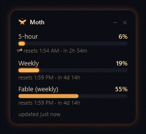
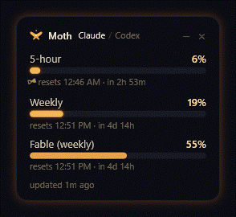

# /moth

<p align="center">
  
</p>

**Your Claude Code usage, always in the corner of your eye — so you never stop to click just to check.**

## Why this exists

Seeing how much Claude Code you've used means stopping what you're doing and clicking into the usage screen — every single time. I just wanted to *know*,
at a glance, without breaking focus.

So Moth is a tiny always-on-top card that keeps your **5-hour** and **weekly** usage in
the corner of your screen. It glows warm amber when you're fine, deepens to orange past
70%, and burns red as you get close to the limit — so you feel the number without even
reading it. No clicking, no context-switch. Like its namesake, it lives beside the
light: the more you burn, the warmer it glows.

By default the numbers come straight from Claude Code's own official usage feed, so they
match the `/usage` screen exactly, and nothing is sent anywhere — everything runs on your
PC. Two opt-in modes go further: **live sync** reads directly from Anthropic, and
**Codex** adds your ChatGPT usage beside your Claude usage. Each has its own honesty
section at the bottom; both are off until you turn them on.

Moth has a sibling: [Cricket](https://github.com/vinvomero/claude-cricket) buzzes your
phone the moment your coding agent finishes. Moth watches how much you've used; Cricket
tells you when the work is done.

## Setup (one time)

> **Just have the link?** Paste this whole repo URL to Claude Code and say *"install
> this for me"* — it can run every step below for you. Or do it yourself:

**1. Get Moth onto your PC.** In PowerShell, clone it to a folder you'll keep
(Moth registers this location with Claude Code, so don't put it somewhere temporary
like Downloads):

```powershell
git clone https://github.com/vinvomero/claude-moth.git
cd claude-moth
```

*No git?* On the GitHub page click **Code ▸ Download ZIP**, extract it somewhere
permanent, then open PowerShell in that folder.

**2. Install:**

```powershell
powershell -ExecutionPolicy Bypass -File install.ps1
```

That's it. Moth appears in the top-left of your desktop (drag it wherever you like —
it remembers). It launches automatically whenever a Claude Code session is active,
and you can bring it back any time by typing **`/moth`** in Claude Code.

The bars fill in the moment your **next** Claude Code session makes its first request.
Until then it shows "waiting for Claude usage data…".

**Resize it** by dragging **any edge or corner**, like a normal window — width and height
are independent, the text stays crisp, and Moth remembers the size. Drag it wide and short
to tuck under your taskbar, or tall and narrow along a screen edge.

> Prefer it to start when you log into Windows instead? Run
> `install.ps1 -AutoStart`. By default Moth only launches with Claude.

## What the bars mean

- **5-hour** — how much of your rolling 5-hour allowance you've used, and when it
  resets. The tiny hourglass beside the reset time turns as the window burns down.
- **Weekly** — same, for the 7-day window.
- **Per-model (when live sync is on)** — a third bar for your model-scoped weekly limit,
  labelled by whichever model it currently tracks (Fable, Opus, Sonnet…). This one is
  Claude-only; Codex doesn't publish per-model limits.
- **Reset times** show the actual clock time *and* the countdown — e.g.
  "resets 10:40 PM · in 4h 20m" — so you know exactly when, not just how long.
- The glow tells the story, and the **whole card heats up** with it: **warm amber**
  normally, **deep orange** past 70%, **red** past 90% — the flame rising as you get close
  to the limit. The halo tracks whichever limit is hottest **across both providers**, so a
  red card while you're looking at calm bars means the *other* provider is the hot one.
- **The tab** (only with Codex on) sits above the bars: click **Claude** or **Codex** to
  switch which one the card is showing. Moth also follows on its own — when the provider
  you aren't watching takes a turn, the card moves to it.
- **`--%`** means *no reading*, not zero. Some plans report no weekly Codex window at all,
  and a `0%` bar there would be a claim rather than a gap.
- "updated Nm ago" tells you how fresh the numbers are. If data ever goes stale, the
  bars and glow mute to grey and the label says "last synced Nm ago" — the card stays
  fully solid, never see-through.

## Keeping it fresh — live sync

Claude Code's status-line feed (Moth's default source) only runs in the **terminal**,
not the desktop app. If you live in the desktop app, turn on **live sync** so Moth
reads your usage directly instead:

```json
// in config.json, or your gitignored window-state.json
"live_sync": true
```

Live sync pulls the same numbers the `/usage` command shows, using the login token
Claude Code already keeps on your machine. See the honesty section below before
enabling — it's off by default on purpose.

## Codex too, if you use it

<p align="center">
  
</p>

If you also code with **Codex**, Moth can show its usage on the same card:

```json
// in config.json, or your gitignored window-state.json
"codex": true
```

Then type **`/moth`** to restart it. A **Claude / Codex** tab appears above the bars, and
the first Codex numbers land within seconds. The halo keeps tracking whichever limit is
hottest across both, so the card can warn you about the provider you aren't looking at.

Turning this on changes **nothing** in your Claude Code settings. Optionally, so Moth can
follow along and switch to whichever provider you're actually using:

```powershell
powershell -NoProfile -ExecutionPolicy Bypass -File tools\install-activity-hooks.ps1
```

That one adds its own hooks — see "What install does" below. Without it the tab still
works; you just click it yourself. (Auto-follow also needs terminal Claude Code; the
desktop app fires no hooks.)

Read **Codex — the honest details** at the bottom before enabling. It runs a program on
your machine, which the default mode never does.

## Mac

There's a menu-bar Moth for macOS too — a [SwiftBar](https://github.com/swiftbar/SwiftBar)
plugin in [`mac/`](mac/). Same real 5-hour + weekly numbers, same amber palette, in
your menu bar — and the same optional Codex section. See [`mac/README.md`](mac/README.md)
for setup. (The tab, auto-follow, and the per-model bar are Windows-only; the Mac plugin
shows both providers at once instead of switching between them.)

## The `/moth` command

Closed the widget? Type `/moth` in any Claude Code session and it restarts —
same position, fresh numbers.

## Turn it off / remove it

```powershell
powershell -ExecutionPolicy Bypass -File uninstall.ps1
```

This closes the widget, removes the `/moth` command, removes any login auto-start, removes
its status-line entry and SessionStart hook from your Claude settings, and removes the
activity hooks if you installed them. Everything else is left untouched. A status line or
hook that is no longer this widget's is left alone.

To turn **Codex** off without uninstalling anything, set `"codex": false` (or delete the
key) and type `/moth`. Nothing is spawned again. To remove the activity hooks on their own:

```powershell
powershell -NoProfile -ExecutionPolicy Bypass -File tools\install-activity-hooks.ps1 -Uninstall
```

Uninstall does not delete `%LOCALAPPDATA%\Moth\`. It holds the Codex snapshot and the
activity stamps; delete the folder yourself if you want it gone.

To hide the widget just for now, click the small **×** in its top-right corner — it
stays hidden for the rest of this session and returns the next time a Claude session
starts (or right away if you type **`/moth`**).

## Files

| File | What it does |
|------|--------------|
| `install.ps1` / `uninstall.ps1` | one-time setup / removal |
| `capture-usage.ps1` | saves your latest usage whenever a Claude session is active (also relaunches Moth if it's not running) |
| `capture-codex.ps1` | asks a local `codex app-server` for your ChatGPT limits — only ever run when `codex` is on |
| `touch-activity.ps1` | records "a turn just happened", so the card can follow the provider you're using (only if you install the activity hooks) |
| `ensure-widget.ps1` | what the SessionStart hook runs — brings Moth back with a new session |
| `widget.ps1` | the moth itself |
| `restart-widget.ps1` | what `/moth` runs — stop + relaunch |
| `commands/moth.md.tmpl` | template for the `/moth` command install |
| `launch-widget.vbs` | starts the widget with no console window |
| `mac/moth.5m.sh` | the macOS menu-bar version (see [`mac/README.md`](mac/README.md)) |
| `tools/` | the test suites, the fixtures they run against, the GIF renderer, and the optional activity-hook installer — nothing here runs unless you run it |
| `assets/moth-logo.svg` | the Moth mark |
| `config.json` | refresh rate, "stale" threshold, default position/size, `live_sync`, `codex` — edit if you like (size is also just drag-resizable) |
| `usage-cache.json` | the latest saved numbers (created automatically) |
| `window-state.json` | where you dragged the widget, plus your personal `live_sync` / `codex` / `codex_exe` overrides (created automatically, gitignored) |
| `widget-error.log` | errors the widget couldn't show you — a failed launch, an unparseable `window-state.json`, a Codex failure that changed class |

Two runtime files live **outside** the repo, under `%LOCALAPPDATA%\Moth\`, because this
folder is often in OneDrive — which rewrites file times and would forge the activity
signal. Nothing here is created unless you turn Codex on.

| File | What it holds |
|------|---------------|
| `codex-cache.json` | the last Codex snapshot: percentages, reset times, window lengths, plan type, and a truncated error message. No account id, no credits, no token |
| `activity.json` | one timestamp per provider — when each last took a turn. No prompts, no content |
| `touch-activity.ps1` | the execution copy the hooks run, if you installed them (the repo copy stays the source of truth) |

## Requirements

- **Claude Code 2.1.80 or newer** — that version is when the official status-line usage
  feed shipped. Check with `claude --version`; upgrade with `winget upgrade Anthropic.ClaudeCode`
  or `claude update`.
- **Windows PowerShell 5.1** (the built-in `powershell.exe`, present on every Windows 10/11).
  The widget uses WPF, which needs the Desktop edition's single-threaded apartment; the
  launcher calls `powershell.exe` explicitly for this reason. If the widget ever fails to
  appear, check `widget-error.log` in this folder.

**For Codex (`"codex": true`) only:**

- **The `codex` CLI**, signed in with your **ChatGPT account** — not an API key. Tested
  with codex-cli **0.152.0** (the desktop app's bundled build). An `npm i -g @openai/codex`
  install works too.
- If yours lives somewhere unusual, point Moth at it with `"codex_exe"` in
  `window-state.json` — **forward slashes**, so the JSON stays valid:
  `"codex_exe": "C:/Users/you/AppData/Local/OpenAI/Codex/bin/abc123/codex.exe"`.
- If you use Codex but *not* Claude Code in the terminal, nothing triggers Moth to launch.
  Install with `-AutoStart` so it starts with Windows.

## What install does (full disclosure)

`install.ps1` makes exactly three changes by default and backs up your settings first:

- Adds a `statusLine` entry to `~/.claude/settings.json` (your pre-install file is saved once to
  `settings.json.usage-widget.bak`). If you already had a custom status line, it warns you before
  replacing it — and uninstall leaves a status line alone if it's no longer this widget's.
- Adds a **`SessionStart` hook** to the same file, so Moth comes back when a Claude
  session starts. Uninstall removes only its own entry and leaves your other hooks alone.
- Adds a `/moth` command file at `~/.claude/commands/moth.md` so you can restart the
  widget from inside Claude Code.

**Turning Codex on makes none of these changes** — `"codex": true` is just a line in a
JSON file Moth already reads.

The **activity-hook installer** (`tools/install-activity-hooks.ps1`, optional, for
auto-follow) is separate and makes its own changes, which uninstall also reverses:

- Two hook entries in `~/.claude/settings.json`, on `UserPromptSubmit` and `Stop`. These
  fire on **every prompt**, not once per session.
- One file, `%LOCALAPPDATA%\Moth\touch-activity.ps1` — a copy, so a folder that moves or
  a OneDrive file that dehydrates can't break a hook that runs on every turn.
- Its own backup at `settings.json.moth-activity.bak`, taken on install only.

Run it with no Claude Code session open: Claude Code hot-reloads `settings.json` and
writes it itself, so a concurrent edit can be clobbered.

Optionally (only with `-AutoStart`): a Startup shortcut that runs the widget **hidden**
(`-WindowStyle Hidden`) with **`-ExecutionPolicy Bypass`**, from this folder. That's a normal
way to run a personal script on login, but you should know it's happening — and keep this
folder somewhere only you can write to, so nobody can swap `widget.ps1` out from under it.

> **Run install from a normal (non-admin) PowerShell.** If you install from an
> elevated "Run as administrator" window, the widget runs elevated too — and Claude
> Code (running normally) then can't see it to refresh or restart it, so `/moth` and
> auto-relaunch stop working. A normal window is the right way to run a personal script.

`uninstall.ps1` reverses all of it cleanly.

## Privacy

By default it does **not** touch your login token, call any private endpoints, or run any
program — it only reads the usage numbers Claude Code already shows you, and everything
stays on your machine. `live_sync` changes the first two; `codex` changes the third. Both
are off unless you turn them on, and each is spelled out below.

## Live sync — the honest details (`live_sync`)

Off by default. Setting `"live_sync": true` (in `config.json`, or in your personal
`window-state.json` to keep the repo clean) makes Moth refresh directly from Anthropic
every ~3 minutes — even in the desktop app, even when no terminal session is running —
and shows a third **per-model weekly** bar (Opus/Sonnet/Fable) when available.
*(The old key name `fable_bar` still works.)*

**Why you'd want it:** the status-line feed only runs in the terminal. In the desktop
app, live sync is the only way to keep the numbers current.

**Read this before enabling:** this mode calls an **undocumented** Anthropic endpoint
(`api/oauth/usage`) using the login token Claude Code already stores on your machine. Several
public tools do the same and it works reliably today, but Anthropic's policy language says
subscription tokens are for Claude Code/claude.ai use, and the endpoint could change or break
at any time. The widget never runs its own login, never logs or transmits the token anywhere
except to Anthropic, sends the `User-Agent` the endpoint expects, backs off politely on errors,
and degrades to the status-line feed if the endpoint fails. If any of that makes you
uncomfortable, leave it off — the default mode is fully within documented behavior.

**Token nudge (part of live sync):** the stored login token expires every ~8 hours, and a
long-running Claude app refreshes it in memory *without* writing the file — which would
freeze live sync mid-session. When Moth sees the token has expired, it wakes a minimal
headless Claude Code process (`claude -p "ok"` on Haiku — one tiny request, at most a few
times a day) so **Claude itself** refreshes and rewrites its token the official way. Moth
never touches the token lifecycle directly. Set `"token_nudge": false` in `config.json` to
disable; Moth will then just show "open a Claude session to re-sync" when it happens.

## Codex — the honest details (`codex`)

Off by default. This one is different in kind from live sync: it doesn't call an endpoint,
it **runs a program on your machine**. Here is everything it does.

**1. It uses an experimental interface.** `codex app-server` is OpenAI's local JSON-RPC
server for editor integrations. It is not a documented public API, and the method Moth
calls (`account/rateLimits/read`) can change or vanish in any release. When it does, Moth
says so in plain words — "this Codex build is too old to report rate limits" — instead of
showing you a stale number.

**2. It launches a hidden process, as you, on a timer.** Roughly every **3 minutes** while
Moth is running, and again shortly after a Codex turn — never more often than once every
**60 seconds**. It runs `codex -s read-only -a never app-server --stdio` with no console
window, waits at most 8 seconds, kills the whole process tree, and exits. It never runs
the bare `codex` command, which can open an interactive browser sign-in.

**3. Moth never reads your Codex credentials — but the process it starts does.**
`~/.codex/auth.json` is never opened by any Moth script. The app-server owns its own login
and makes the request to OpenAI itself, exactly as it does when your editor talks to it —
which means it may **refresh and rewrite that token file**, the same as any other Codex
session would.

**4. It loads your whole Codex config.** Starting the app-server reads `~/.codex/config.toml`,
including any **MCP servers** you have configured. On codex-cli 0.152.0 this was measured
*not* to start them for a rate-limit read — the only processes that appeared were the
app-server itself. That is an observation of one version, not a guarantee of every version.

**5. Activity is a file's timestamp, never its contents.** To follow the provider you're
actually using, Moth reads the **modified time** of the newest file under
`~/.codex/sessions/`. It never opens those files — your prompts and transcripts are not
read. (It deliberately ignores `logs_2.sqlite-wal`, which ticks every ~12 seconds on its
own and would report activity that never happened.)

**6. No Codex hooks are installed.** Whether the Codex desktop app fires the hooks in
`~/.codex/hooks.json` is unconfirmed, and a hook that silently never fires is worse than
no hook. Nothing is added to any Codex config.

**7. What the cache holds.** `%LOCALAPPDATA%\Moth\codex-cache.json`: your two percentages,
their reset times and window lengths, your plan type, and — on failure — an error class,
a JSON-RPC code, and a message truncated to 200 characters. The reply is copied field by
field, so the account id, credit balance, and upsell text that arrive alongside it are
**dropped**, not stored.

**8. The activity hooks, if you install them.** Two entries in `~/.claude/settings.json`
(`UserPromptSubmit` and `Stop`) that run `%LOCALAPPDATA%\Moth\touch-activity.ps1`. All it
writes is one epoch timestamp per provider. They fire on every prompt, so they run from a
copy outside this folder rather than from OneDrive. `-Uninstall` removes both, and refuses
to touch a `settings.json` it can't parse.

**9. How it finds `codex`.** In order: your `"codex_exe"` override, then `CODEX_CLI_PATH`
in `~/.codex/config.toml` (which the desktop app rewrites on every update), then `PATH`
(preferring `codex.exe`, then `codex.cmd` — never the `.ps1`, which can't be launched
directly), then the newest build under `%LOCALAPPDATA%\OpenAI\Codex\bin`. If none of that
finds it, set the override with forward slashes:

```json
"codex_exe": "C:/Users/you/AppData/Local/OpenAI/Codex/bin/abc123/codex.exe"
```

If any of this makes you uncomfortable, leave it off. Nothing above happens while
`"codex"` is absent or `false`.

```text
       *

  .~\     /~.
  \  \   /  /
   `-.\ /.-'
     (o o)
      ) (
     '   `
```
<p align="center"><em>drawn to the light</em></p>
