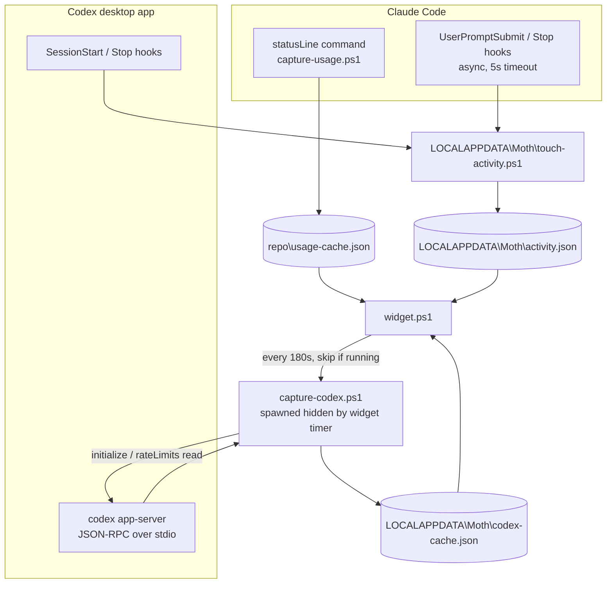
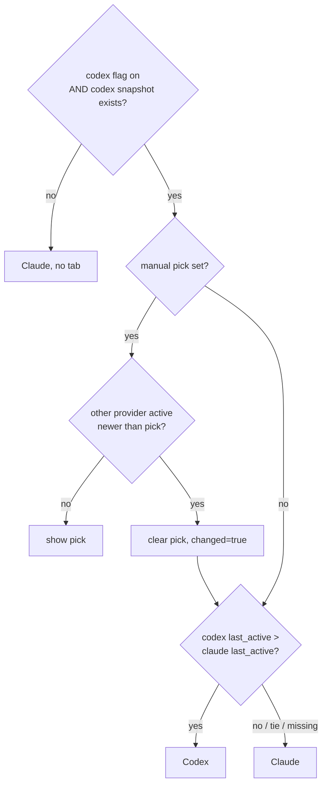

# feat: Codex as a second usage provider in Moth

## Summary

Add OpenAI Codex as a second provider behind the existing card. A hidden helper script polls Codex's local app-server and writes a Codex cache; hooks on both tools record real turn activity; the widget picks the provider to show from that activity (with a title-bar tab to override), renders it into the existing bars through a per-provider view model, and warms the halo from the hottest fresh limit across both. Opt-in, personal scope, nothing committed until asked.

---

## Problem Frame

Codex is a daily tool on this machine with its own 5-hour and weekly limits. At the moment of writing, the live Codex reply shows the 5-hour window at 100% and the weekly at 69% — and Moth shows none of it. Checking means opening the Codex app, which is the interruption Moth exists to remove. Existing multi-provider tools (CodexBar, ClaudeBar) are click-to-reveal tray apps; they solve the data problem, not the glance problem. See origin for the full framing.

---

## Requirements

Requirements R1–R12 are carried from the origin document; R11 is reworded per the flow analysis (see KTD "Window never resizes on switch"). R13–R17 are plan additions.

**Provider selection**

- R1. Moth shows one provider at a time: Claude Code or Codex.
- R2. Moth switches to a provider automatically when that provider shows activity more recently than the other, where activity means a turn or session event, never a data-refresh heartbeat and never a poll Moth itself performs.
- R3. A tab in the title bar lets the user pick a provider manually; the pick and its timestamp persist across restarts.
- R4. A manual pick holds until the other provider shows activity newer than the pick, at which point the pick is cleared and auto-follow resumes.
- R5. With the Codex opt-in flag off, or with no Codex snapshot ever captured, Moth behaves exactly as today: Claude only, no tab, no Codex process spawned.

**Codex data**

- R6. The Codex view shows a 5-hour bar and a weekly bar with used percentage and reset countdown, matching the Claude bars in look and behavior.
- R7. Codex bars grey under the same stale rules as Claude bars, driven by the Codex snapshot's own timestamp.
- R8. Codex usage is read through Codex's app-server; Moth never reads or stores Codex credentials, and the cache holds only the fields the widget renders.
- R9. Codex polling never launches the interactive Codex CLI and never shows a console window.
- R13. Codex data and the activity file live outside the repo folder, under `%LOCALAPPDATA%\Moth\`.
- R14. A Codex poll never blocks the widget's UI thread; a hung app-server is killed within a bounded deadline and never leaves an orphaned `codex.exe`.

**Halo and status**

- R10. The halo reflects the hottest limit across both providers regardless of which is visible.
- R15. The halo considers only fresh buckets; a stale bucket on either provider never drives the halo color.
- R16. Status text below the bars is scoped to the visible provider; Claude sync hints never render over Codex bars and vice versa.

**Card**

- R11. The Codex view shows no per-model bar; the window size does not change on switch, and the two bars re-center as they do today when the per-model bar is hidden.
- R12. Switching providers leaves the remembered window size and position untouched.
- R17. The card keeps updating (countdowns, staleness) whenever any provider has data, including Codex-only with no Claude cache.

---

## Key Technical Decisions

- **The view model is the widget's contract; the cache file shape is a convenience.** `codex-cache.json` uses Moth's field names (`five_hour`, `seven_day`, `captured_at`) so the helper can reuse the existing percent/epoch parsers and the atomic-write idiom, but the two files have different contracts (`Read-Cache` requires both Claude buckets; `Read-CodexCache` requires only `five_hour` and `captured_at`, and `resets_at` may be null). Each reader is the sole code that knows its file's fields and produces a per-provider view `{ provider, p5, r5, p7, r7, stale5, stale7, window5Secs, fable?, capturedAt, status }`. The paint path, the halo, and the "do I have data" gate consume views only. Today `$script:cache` doubles as the data gate and the 1-second tick does nothing without it; the gate becomes "any provider has a view" so a Codex-only card keeps ticking (R17).

- **Both runtime files live under `%LOCALAPPDATA%\Moth\`.** Both Claude writers rebuild `usage-cache.json` from scratch and carry forward only the `fable` bucket, so a Codex bucket there would be wiped every ~15 s. A separate file in the repo folder would be rewritten every 3 minutes inside OneDrive (upload churn, occasional sharing violations on `File.Replace`), and the activity file must be outside OneDrive anyway so sync never forges its timestamp. One folder outside the repo for everything this feature creates removes the `.gitignore` edit and the mixed-location explanation.

- **Polling runs in a separate hidden helper script; the widget only reads.** All widget timers run on the WPF dispatcher thread and the repo has no async precedent; the existing endpoint poll already blocks the card for up to 15 s, and R14 sets a stricter bar than the Claude path meets today. `capture-codex.ps1` mirrors `capture-usage.ps1`: it owns the spawn, the JSON-RPC exchange, the deadline, the child kill, and the atomic cache write. The widget launches it with `Start-Process -WindowStyle Hidden -PassThru` (the `Invoke-TokenNudge` idiom; `ShellExecuteEx` with `SW_HIDE` creates the helper's console already hidden), never `-Wait`, never `-RedirectStandardOutput`. Do not "simplify" this to an in-process spawn later.

- **Bounded read = `ReadLineAsync` + `Task.Wait(remaining)` against one absolute deadline, inside the helper.** `StandardOutput.ReadLine()` has no timeout, so a server that accepts the connection and never answers hangs forever and `WaitForExit(ms)` is never reached. The helper computes one deadline before the first write and passes `deadline − now` to each `Wait` (never a fixed per-line slice, or notifications multiply the budget). Event-driven readers are rejected for PowerShell 5.1: scriptblock delegates run on a thread without a runspace (PowerShell #24687) and `Register-ObjectEvent -Action` only fires while the pipeline thread is idle, which any blocking wait prevents (PowerShell #11065). Stderr is redirected and drained with a handler-less `BeginErrorReadLine()` — the app-server's tracing layer writes to stderr under `RUST_LOG`, and a full stderr pipe stalls the child indistinguishably from a hang. `Kill(true)` is .NET Core-only; kill is `HasExited`-guarded `Kill()` then `WaitForExit`, with the `codex.exe` child killed in a `finally`, and `taskkill /T` reserved for the widget's anomaly path.

- **Activity is an edge signal written by hooks; the fallback is the newest session rollout file.** The Claude statusLine heartbeats every ~15 s while a session is merely open and the live_sync poll rewrites `captured_at` every 3 minutes with no session at all; keying auto-follow on those would snap the card back to Claude seconds after every Codex turn. `touch-activity.ps1 -Provider claude|codex` writes `{ claude, codex }` epochs to `activity.json`, invoked by Claude Code `UserPromptSubmit`/`Stop` hooks and Codex `SessionStart`/`Stop` hooks. If the Codex desktop app does not fire hooks, the fallback is the write time of the newest `~/.codex/sessions/YYYY/MM/DD/rollout-*.jsonl`, which grows only on real turns and which a rate-limit read never creates. Two candidates are rejected on evidence: `logs_2.sqlite-wal` advances with no user turns (touched at 09:01 today with no session since 06:17) and is very likely touched by Moth's own poll — a self-triggering heartbeat; Codex's `notify` slot in `config.toml` is a single slot already occupied by the desktop app's computer-use runtime.

- **The hook toucher is output-free and exit-0 by construction, and runs from a copy outside OneDrive.** A `UserPromptSubmit` hook's stdout is injected into the model's context on every prompt, exit code 2 blocks the prompt, and the hook's stdin carries the prompt text. The toucher never reads stdin, writes nothing to stdout or stderr, exits 0 in every branch, and logs nothing. Hooks fire on every prompt, so they point at `%LOCALAPPDATA%\Moth\touch-activity.ps1`, a copy the installer refreshes; the repo copy is the source of truth, never the execution path. Hook entries are `async: true` with a 5 s timeout so a slow PowerShell start can never delay a prompt.

- **Provider selection is a pure reducer with exactly two callers.** `Resolve-ProviderState(state, inputs) → { provider, pick, pickedAt, tabVisible, changed }` does no I/O and is unit-tested by the repo's AST-extraction pattern (`tools/test-scoped-weekly.ps1`). The `$poll` tick (after reading the three files) and the tab-click handler are the only callers, and each persists the result when `changed`; `SourceInitialized` runs the same read-and-resolve once so the card opens on the right provider before the first `$poll`. `Update-Display` paints `$script:view` and never selects. Ties and missing timestamps resolve to Claude, the incumbent.

- **Halo = max over fresh buckets across both views.** Today `heat = max(p5, p7, pf)` includes a stale per-model value — a latent bug Codex would make worse (a frozen 100% Codex snapshot keeps the card red for days). A bucket contributes only when its own timestamp is within `stale_minutes`; if no bucket is fresh the halo goes grey at minimum opacity. Visible-stale plus hidden-hot is an accepted new visual state: grey bars, hot halo.

- **Window never resizes on switch.** `Save-WindowState` persists size on every change; a card that shrank for the Codex view would save the shorter height or ping-pong. The window has a fixed size with the bars panel vertically centered, so hiding the per-model bar already re-centers rather than shrinks. R11 is reworded to match.

- **JSON-RPC exchange verified against the installed binary (`codex-cli 0.152.0`).** Newline-delimited JSON over stdio, no banners; `initialize` with `clientInfo`, then the `initialized` notification, then `account/rateLimits/read` with **no params** (object params are rejected on this version). Match replies by integer `id`, not order; a reply carrying an `error` member is a failure even if `result` is present; ignore unsolicited notifications; cap the read at 200 lines / 1 MiB; keep stdin open until the reply arrives, then close it and the process exits within ~0.5 s. Prefer `rateLimitsByLimitId.codex`, fall back to `rateLimits`; treat every snapshot field as nullable; bound `resets_at` to a sane window before it reaches countdown arithmetic. The parser whitelists fields: `accountId`, `credits`, upsell text, `userAgent`, and `codexHome` are never written.

- **Binary discovery: override, then Codex's own record, then glob, with a signer check on change.** `codex` is not on PATH. The desktop app installs `%LOCALAPPDATA%\OpenAI\Codex\bin\<hash>\codex.exe` and replaces the folder on update — observed live on 2026-09-03: the hash folder changed at 09:15 and the app rewrote `~/.codex/config.toml` at 09:16 with `CODEX_CLI_PATH` pointing at the new exe. Resolution order: `codex_exe` from `window-state.json` (must exist, `.exe`), then `CODEX_CLI_PATH` read from `config.toml` by a line match (no TOML parser), then the newest `codex.exe` under `bin\*\` by write time (a sibling folder holds only `rg.exe`). Verify the Authenticode signature (status Valid, subject containing `OpenAI OpCo`) only when the resolved path or its size/mtime differs from the last verified one, persisted in the cache; the override path skips the check so test doubles work. This is a reliability control with an integrity bonus, not a security boundary: anyone who can plant a binary there already owns the session.

- **Opt-in and persistence follow the `live_sync` pattern.** A `codex` boolean in gitignored `window-state.json` (read by the selective merge block, folded into one `$CODEX_ON` constant) gates the timer start and the tab. `provider` / `provider_picked_at` persist through a read-merge-write of the same file, since `Save-WindowState` only writes on position change. Nothing in tracked `config.json` changes.

---

## High-Level Technical Design

Three processes feed three files; the widget is the only reader of all three.



Provider selection, run by the `$poll` tick, the tab handler, and once at startup:



Directional sketch of the reducer, not implementation:

```text
Resolve-ProviderState(state, inputs):            # pure; caller persists when changed
  if not (inputs.codexOn and inputs.codexPresent):
      return { provider:'claude', tabVisible:false, pick:state.pick, changed:false }
  pick = state.pick; changed = false
  if pick:
      other = opposite(pick)
      if inputs.lastActive[other] > state.pickedAt: pick = null; changed = true
      else: return { provider:pick, tabVisible:true, pick, changed }
  provider = (inputs.tCodex > inputs.tClaude) ? 'codex' : 'claude'   # tie/missing -> claude
  return { provider, tabVisible:true, pick, changed }
```

Helper exchange with the deadline, directional:

```text
deadline = now + HELPER_MS                         # one absolute deadline, before Start
start codex.exe app-server: no shell, no window, stdin/stdout/stderr redirected, UTF-8
BeginErrorReadLine()                               # no handler: drains stderr
write initialize / initialized / rateLimits lines; keep stdin OPEN
loop until reply with id==2:
    remaining = deadline - now; if <= 0 -> TIMEOUT
    t = StandardOutput.ReadLineAsync(); if not t.Wait(remaining) -> TIMEOUT
    line = t.Result; null -> FAIL; skip lines whose id != 2; cap lines/bytes
on reply: close stdin; WaitForExit(2000) else kill; whitelist fields; atomic write
on TIMEOUT/FAIL: kill child (HasExited-guarded); log once via last_error; exit code by class
```

Render path after selection: build one view per provider that has data, paint the selected view into `Track5`/`Track7`, collapse `FableGroup` unless the view carries a `fable` bucket, then compute heat from every fresh bucket in *both* views.

---

## Implementation Units

Dependency order: U1 → U3 → U7; U2 independent; U5 after U3; U4 after U3 and U2; U8 after U4, U5, U7; U6 last. U-IDs are stable; U7 and U8 were split out of U3 and U5 during deepening.

### U1. Codex fetch helper and parser

- **Goal:** A standalone script that locates the Codex binary, spawns the app-server, reads the rate-limit snapshot within a hard deadline, and atomically writes `codex-cache.json` — with the parser as a pure, fixture-testable function.
- **Requirements:** R6, R8, R9, R13, R14 (helper side)
- **Dependencies:** none
- **Files:**
  - `capture-codex.ps1` (new)
  - `tools/test-codex-parse.ps1` (new)
  - `tools/fixtures/codex-ratelimits-full.json`, `tools/fixtures/codex-ratelimits-secondary-null.json`, `tools/fixtures/codex-ratelimits-error.json`, `tools/fixtures/codex-config-clipath.toml` (new)
  - `widget-error.log` (modify: append `codex:` lines on `last_error` change)
- **Approach:** `Find-CodexExe` applies the resolution order in the discovery KTD and the change-triggered signer check. Spawn per the bounded-read KTD: `ProcessStartInfo` with `UseShellExecute=$false`, all three streams redirected, `CreateNoWindow=$true`, `StandardOutputEncoding` UTF-8, the widget's environment unchanged (no `CODEX_HOME`, `RUST_LOG` removed). Write the three protocol lines (`clientInfo` name `moth`), read with `ReadLineAsync` + `Task.Wait(remaining)` against one deadline (8 s), drain stderr with a handler-less `BeginErrorReadLine`, treat a null line as failure, cap at 200 lines / 1 MiB. On reply close stdin, `WaitForExit(2000)`, then parameterless `WaitForExit()`. In every exit path kill the child if it has not exited. `ConvertFrom-CodexRateLimits` maps `rateLimitsByLimitId.codex` (fallback `rateLimits`) → `{ five_hour: {used_percentage, resets_at}, seven_day: {...}, plan_type, captured_at, verified_exe, verified_mtime, last_error }`; `primary` required, `secondary` optional; reuse the repo's number/epoch rules (`InvariantCulture`, clamp 0–100, `$null` is skip not zero, `resets_at` bounded to now−1 day … now+1 year). On failure write nothing to the buckets; record `last_error` (class + first 200 chars of `error.message`, never `error.data`) and append one `codex:` line to `widget-error.log` only when `last_error` changed. Atomic write: per-PID temp, `File.Replace` with `[NullString]::Value`, no BOM, whole swap in try/catch. Take the named mutex `Global\MothCodexCapture` at start and exit quietly if held. Exit codes distinguish ok / timeout / rpc-error / parse-fail / binary-missing.
- **Patterns to follow:** `capture-usage.ps1` (cache write contract, `Write-Utf8NoBom`, `ConvertTo-Pct`/`ConvertTo-Epoch`), `widget.ps1` `Write-ErrorLog` style and the `Global\MothWidget` mutex, `tools/test-scoped-weekly.ps1` (AST extraction, `Check` helper, exit 1 on failure). Reference exchange: the verified transcript in Sources.
- **Test scenarios:**
  - Full fixture → both buckets, percentages and epochs match, `plan_type` = `team`; `accountId`, `credits`, upsell fields absent from the output.
  - `secondary` null → `five_hour` present, `seven_day` absent, no error. **Covers AE19.**
  - `rateLimitsByLimitId` absent → falls back to `rateLimits`.
  - `usedPercent` as string `"42"` → 42; `"abc"` → bucket omitted, not 0.
  - `resetsAt` null → `resets_at` null, bucket present; `resetsAt` two years out → clamped.
  - Reply with both `error` and `result` → failure.
  - JSON-RPC error (`-32600 "chatgpt authentication required"`) → nothing written to buckets, `last_error` set, one log line; a second identical failure adds no line. **Covers AE6, AE16.**
  - Reply line for a different `id` and an unsolicited notification line are skipped.
  - Discovery: fixture `config.toml` with `CODEX_CLI_PATH` at a nonexistent file → falls through to the glob; two bin folders where the older hash has the newer mtime → `CODEX_CLI_PATH` wins; override set → override wins and the signer check is skipped.
  - Binary missing everywhere → `last_error` binary-missing, no cache buckets, distinct exit code.
  - Manual: live run produces `codex-cache.json` with today's values; no console window; after exit `tasklist` shows no `codex.exe`; during the run the `codex.exe` child has no children of its own (no `node_repl.exe`, `codebase-memory-mcp.exe`, sandbox helper) and no outbound connection other than the backend. **Covers AE17.**
  - Manual: `codex_exe` pointed at a script that never answers → exits at the deadline with the timeout code, child killed. **Covers AE18.**
  - Manual: `codex_exe` pointed at a script that answers `initialize` then never answers id 2 → same. **Covers AE18.**
  - Manual: `codex_exe` pointed at a script that writes 64 KB to stderr before answering → reply still returned within the deadline.
  - Manual: compare `~/.codex/logs_2.sqlite-wal` and the newest rollout mtime before and after a helper run; record whether the poll touches either.
- **Verification:** `tools/test-codex-parse.ps1` passes; a live run yields a cache the widget's numeric validator accepts; the four manual runs behave as listed.

### U2. Activity signal and hook installer

- **Goal:** Record real turn/session activity per provider in `activity.json`, via hooks on both tools that run a copy of the toucher outside OneDrive.
- **Requirements:** R2, R4
- **Dependencies:** none
- **Files:**
  - `touch-activity.ps1` (new; source of the installed copy)
  - `tools/install-activity-hooks.ps1` (new; `-Uninstall` supported)
  - `uninstall.ps1` (modify: call the hook uninstaller)
- **Approach:** First, a cheap check the user can answer: `~/.codex/hooks.json` already has a `Stop` hook that plays `notify.wav`; if that sound plays after a turn in the Codex desktop app, hooks fire on this surface. If not, skip the Codex hook entries and rely on the rollout-file fallback (U3). The toucher implements the output-free/exit-0/no-stdin contract from the KTD, `-Provider` restricted to `claude|codex`, read-merge-write of `activity.json`, folder created on first run. The installer copies the toucher to `%LOCALAPPDATA%\Moth\`, then adds `UserPromptSubmit` and `Stop` entries (`async: true`, `timeout: 5`) to `~/.claude/settings.json` in the double-quoted `-File` form `install.ps1` already uses, and `SessionStart` + `Stop` entries to `~/.codex/hooks.json` in the single-quoted, operator-free form the existing Codex entries use (valid under bash and PowerShell; the shell Codex uses on Windows is unverified). Idempotency fingerprint includes the `-Provider` value, so a Claude-flavored entry found in the Codex file (Codex's external-agent import may copy Claude hooks) is reported, never counted as installed. Backups are per-tool (`settings.json.moth-activity.bak`, `hooks.json.moth.bak`), written once. Re-read each file immediately before writing; validate structurally after (every `hooks.<Event>` is an array, every group has an array `hooks`, every hook has `type` and `command`), plus BOM byte-check and JSON re-parse. `-Uninstall` removes exactly the fingerprinted entries.
- **Execution note:** The installer modifies the user's live Claude Code and Codex configuration. Run it only with an explicit go from the user, with no Claude Code session open and the Codex app closed; never as part of an automated verification step.
- **Patterns to follow:** `install.ps1` (settings merge, `[object[]]` array handling, BOM byte-check, backup), the fingerprint idempotency in `claude-cricket/install.ps1`, `Write-Utf8NoBom`.
- **Test scenarios:**
  - Toucher: fresh machine → folder and file created with only the named provider key; the other provider's timestamp preserved on write.
  - Toucher: garbage on stdin, read-only folder, folder deleted, invalid `-Provider` → stdout and stderr empty, exit 0 in all cases.
  - Installer run twice → each hook exactly once; `-Uninstall` restores the pre-install hook list; existing hooks (sound, ntfy, cbm-*) untouched.
  - Installer output: both files valid JSON, no BOM, every event value an array (including single-entry events).
  - A pre-seeded `-Provider claude` entry in `hooks.json` → reported, not counted, not duplicated.
  - Manual: one prompt in Claude Code → `claude` epoch advances within 5 s; one Codex turn → `codex` epoch advances (record whether the desktop app fired the hook).
  - Manual: after the Codex app's next import/sync cycle, `hooks.json` contains no `-Provider claude` entry (record the result).
- **Verification:** After one prompt in each tool, `activity.json` carries two recent epochs; `git status` in the repo is unchanged by the installer.

### U3. Widget config merge and readers

- **Goal:** The widget learns the opt-in flag and the provider keys, and reads `codex-cache.json` and `activity.json` with the same validation discipline as today, producing per-provider views.
- **Requirements:** R5, R7, R13, R17
- **Dependencies:** U1
- **Files:**
  - `widget.ps1` (modify: config/state merge block, new `Read-CodexCache`, `Read-Activity`, `ConvertTo-ProviderView`, data gate)
- **Approach:** Extend the selective `window-state.json` merge to read `codex`, `codex_exe`, `provider`, `provider_picked_at`; fold `codex` into `$CODEX_ON`. `Read-CodexCache` reads `%LOCALAPPDATA%\Moth\codex-cache.json`, reuses the numeric guards of `Read-Cache`, requires only `five_hour` and `captured_at`, allows null `resets_at`, and surfaces `last_error` for status text. `Read-Activity` returns two epochs (missing → null, future → clamped to now); when the Codex hook signal has never been observed it substitutes the newest rollout file's write time. `ConvertTo-ProviderView` builds the view from either cache with per-bucket freshness and `window5Secs` (18000 default). Replace the `$script:cache` gate with `$script:views` — the 1-second tick and the early-return run on "any view present", and the waiting message names the provider. The `$poll` tick reads all three files.
- **Patterns to follow:** `Read-Cache` validation and the fable bucket's own-timestamp staleness, the `$null -ne` merge guards, `ConvertTo-Epoch`.
- **Test scenarios:**
  - Flag off with a Codex cache on disk → `$CODEX_ON` false; views contain Claude only. **Covers AE11.**
  - Flag on, no Codex cache → Claude-only views; no error. **Covers AE3.**
  - Malformed Codex cache → dropped; Claude view unaffected; no crash.
  - Codex cache with null `resets_at` → view carries null reset; no coercion to 0.
  - Claude cache absent, Codex present → one view; data gate open. **Covers AE12, R17.**
  - Activity file missing → both epochs null; future epoch → clamped. **Covers AE10.**
  - Rollout fallback: no hook signal ever seen and a rollout file newer than the Claude epoch → Codex epoch taken from the rollout.
- **Verification:** With a hand-written `codex-cache.json` and `activity.json`, `-SelfTest` reports both views; with the flag off the report is byte-identical to today's.

### U7. Codex poll timer and process supervision

- **Goal:** Run the helper on a timer without ever blocking the UI, never let a hung helper or its child linger, and re-poll promptly after a Codex turn.
- **Requirements:** R9, R14
- **Dependencies:** U3
- **Files:**
  - `widget.ps1` (modify: timers in `SourceInitialized`, new `Invoke-CodexPoll`)
- **Approach:** Add a `$cx` `DispatcherTimer` (base 180 s, same backoff/reset discipline as `$ep`, backoff capped below `stale_minutes`). Its tick launches `capture-codex.ps1` with `Start-Process -WindowStyle Hidden -PassThru`, keeps the `Process` in `$script:cxProc`, and skips while `HasExited` is false. The helper's own 8 s deadline is the primary bound; the widget's 30 s check is an anomaly path: log once, then terminate with `taskkill /PID <id> /T /F` launched hidden (no tree kill in .NET Framework). Start the timer only from `SourceInitialized` and only when `$CODEX_ON`; schedule the first poll after first paint. When the Codex activity epoch advances between `$poll` ticks, trigger an immediate poll so Codex bars refresh within one `$poll` interval of a turn; initialize the last-seen epoch from the file at startup so the first read never triggers spuriously. Liveness: when the Codex activity epoch lags the newest rollout mtime by more than 30 minutes, log once that the hook signal looks dead.
- **Patterns to follow:** `$ep` timer lifecycle and backoff, `Invoke-TokenNudge` spawn idiom, the `-File`/`-SelfTest` process-matching rules (the helper name must not end in `widget.ps1`).
- **Test scenarios:**
  - Flag off → timer never started; no spawn. **Covers AE11.**
  - Helper still running at the next tick → tick skipped, at most one log line.
  - Backoff never exceeds `stale_minutes`.
  - Activity advance between ticks → immediate poll; startup read → no poll.
  - Manual: during a poll the 1-second countdown keeps ticking and the card stays draggable. **Covers AE17, AE18.**
  - Manual: force-kill a hung helper via the anomaly path → `tasklist` shows no `codex.exe` afterward. **Covers AE26.**
  - Manual: `restart-widget.ps1` mid-poll → old helper finishes its write; the new instance's next tick either skips (mutex held) or runs cleanly.
- **Verification:** With the flag on, `codex-cache.json` refreshes on the timer and within one `$poll` interval of a Codex turn; with it off, no `codex.exe` is ever created.

### U5. Render refactor: build-view plus paint, Claude-only, screenshot-identical

- **Goal:** Split `Update-Display` into "build view" and "paint view" with the Claude view only, so U8 lands Codex rendering on a paint path that already accepts a provider — and add the dev-mode parameters U5–U8 tests need.
- **Requirements:** R6, R11, R17 (structure only; no user-visible change)
- **Dependencies:** U3
- **Files:**
  - `widget.ps1` (modify: `Update-Display`, dev-mode parameters)
- **Approach:** Move today's bucket math, per-bucket staleness, hourglass, and `FableGroup` logic into painting a view; the halo and status blocks read from the view for now. Handle a null reset in a present bucket: reset text blank, hourglass collapsed. Add `-CodexFixture <path>` and `-Provider claude|codex` to the dev-mode parameters; they bypass timers (which only start in `SourceInitialized`) and load raw fixtures the way `-SelfTest` loads the Claude cache. Extend the `SELFTEST OK` line with `Provider=` and `Tab=` (`tools/make-demo-gif.ps1` discards the line).
- **Execution note:** Pure refactor. Capture a `-Screenshot` of the Claude view before starting and diff against it when done.
- **Patterns to follow:** Existing `Update-Display`, `-SelfTest`/`-Screenshot` block, `[Environment]::Exit(0)` on dev-mode exit.
- **Test scenarios:**
  - `-Screenshot` of the Claude view before and after → pixel-identical with the flag off.
  - Existing `-SelfTest` fixtures → same `SELFTEST OK` values as before plus `Provider=claude Tab=hidden`.
  - Claude fixture with null `resets_at` in `five_hour` → blank reset text, hourglass collapsed, no exception.
- **Verification:** Screenshot diff clean; existing fixture tests unchanged.

### U4. Provider selection, persistence, and the title-bar tab

- **Goal:** Choose the visible provider from activity and the manual pick, persist the pick, and give the user a click target.
- **Requirements:** R1, R2, R3, R4, R5, R12
- **Dependencies:** U3, U2
- **Files:**
  - `widget.ps1` (modify: new `Resolve-ProviderState`, `Save-ProviderPick`, title-bar XAML, mouse handlers, `SourceInitialized`)
  - `tools/test-resolve-provider.ps1` (new)
- **Approach:** `Resolve-ProviderState` as in the design sketch — pure, deterministic on ties. Callers: the `$poll` tick after reading files, the tab-click handler (sets the pick, resolves, persists synchronously — user-driven and rare), and `SourceInitialized` once. `Save-ProviderPick` read-merge-writes `provider` and `provider_picked_at` into `window-state.json` without touching size keys. Tab: two `TextBlock`s after the "Moth" title in the left title-bar stack, active in cream, inactive in the dim label color, hidden when `tabVisible` is false; handle `MouseLeftButtonDown` with `Handled = $true` and act on down like the minimize/close buttons so `DragMove` never swallows the click. Set brushes only on change. At the 230 px minimum width the title row has roughly 60 px spare, so labels are "Claude" / "Codex" and drop to first letters below a width threshold. Note: `tools/make-demo-gif.ps1` restores `window-state.json` wholesale, so a pick made during a GIF render is reverted — expected.
- **Patterns to follow:** `Select-ScopedWeekly` (pure + deterministic tie-break), `Save-WindowState` (read-merge-write, preserve unknown keys), `MinBtn`/`CloseBtn` handlers.
- **Test scenarios (fixture test, AST-extracted):**
  - Flag off → Claude, tab hidden, regardless of pick.
  - Flag on, no Codex snapshot → Claude, tab hidden, persisted `codex` pick ignored. **Covers AE3.**
  - No pick, Codex activity newer → Codex. **Covers AE1 (auto part), F1.**
  - No pick, Claude newer → Claude. Tie or both null → Claude. **Covers AE10.**
  - Pick Claude at T, Codex activity at T+30 → Codex, pick cleared, `changed` true. **Covers AE1.**
  - Pick Claude, only Claude activity afterward → Claude indefinitely, `changed` false. **Covers AE2.**
  - Pick Codex, Claude activity newer than pick → Claude. **Covers R4 mirror.**
  - Pick Codex, restart, no newer activity → Codex. **Covers AE9.**
  - Claude heartbeat only (statusLine `captured_at` advancing, no hook event) while showing Codex → stays Codex. **Covers AE7, AE8.**
  - A Moth poll advancing nothing in `activity.json` → provider unchanged. **Covers AE25.**
- **Test scenarios (manual):** Tab click switches on button-down and starts no drag; the "Moth" text still drags. **Covers AE21.** After a switch, `window-state.json` changes only in the provider keys. **Covers AE20.** Card opens on the persisted provider before the first `$poll`.
- **Verification:** `tools/test-resolve-provider.ps1` passes; the pick survives a restart; a Codex turn flips the card within one `$poll` interval.

### U8. Codex view, cross-provider halo, status scoping

- **Goal:** Paint the Codex view through the shared paint path, compute the halo from fresh buckets across both views, and scope status text per view.
- **Requirements:** R6, R7, R10, R11, R12, R15, R16
- **Dependencies:** U4, U5, U7
- **Files:**
  - `widget.ps1` (modify: view building for Codex, halo block, `Updated` label state machine)
- **Approach:** The Codex view comes from `Read-CodexCache`; a snapshot without `seven_day` renders the weekly bar as `--%` with an empty fill and no stale color. `FableGroup` visibility follows the view. Heat = max of every bucket whose own timestamp is within `stale_minutes`, across both views; no fresh bucket → grey halo at minimum opacity. The `Updated` label reads the visible view only: Claude keeps the existing expired/absent-token messages; Codex shows "codex: last synced Nm ago", "sign in to Codex", "Codex app-server not found", or "Codex poll timed out", from the helper's `last_error` class.
- **Patterns to follow:** Existing fable block (optional bucket, own staleness), `Get-BarColor` thresholds, `Format-Remaining`.
- **Test scenarios:**
  - Codex fixture, `-Provider codex` → two bars, `FableGroup` collapsed, countdowns correct. **Covers AE22 (render part), R11.**
  - Codex fixture without `seven_day` → `--%`, empty fill, not grey. **Covers AE19.**
  - Hidden provider stale at 95%, visible fresh at 20% → halo at 20%. **Covers AE13.**
  - Visible stale, hidden fresh at 88% → grey bars, halo at 88%. **Covers AE14.**
  - Both stale → grey halo, minimum opacity. **Covers AE15.**
  - Codex-only (no Claude cache) → countdown advances each tick. **Covers AE12, AE27.**
  - Codex view with the Claude token expired → no "open a Claude session to re-sync". **Covers AE23.**
  - Each `last_error` class → its status string; no class → "last synced".
  - Window size identical before and after a switch. **Covers AE20.**
- **Verification:** `-SelfTest` fixtures for the five halo/staleness combinations produce the expected lines; the Claude view with the flag off is still screenshot-identical to the release.

### U6. Fixtures and acceptance pass

- **Goal:** Ship the fixtures the dev modes need and walk every acceptance example end to end.
- **Requirements:** verification support for all
- **Dependencies:** U8
- **Files:**
  - `tools/fixtures/codex-cache.sample.json`, `tools/fixtures/codex-cache.no-weekly.json`, `tools/fixtures/activity.sample.json` (new)
- **Approach:** Write the fixtures used by U5–U8, then walk AE1–AE27 in order, recording pass/fail in the commit message. Any failure becomes a fix in the owning unit before the pass is declared complete.
- **Test scenarios:**
  - `-SelfTest <claude-fixture> -CodexFixture <codex-fixture> -Provider codex` → `Provider=codex`, `FableGroup` collapsed, no process spawned. **Covers AE22.**
  - Full manual pass of AE1–AE27.
- **Verification:** All fixture tests green; acceptance pass recorded; `git status` shows only intended new and modified files, with `window-state.json` still ignored and nothing new under the repo at runtime.

---

## Scope Boundaries

- Public release: README section, Mac cousin (`mac/moth.5m.sh`), `install.ps1` changes, anything that assumes another machine's layout.
- Codex credits balance, plan type display, and the reset-credit upsell, although the helper stores `plan_type`.
- Per-model bars for Codex; cost or token tracking for either provider.
- Showing both providers at once, two Moth instances, or any window auto-sizing.

### Deferred to Follow-Up Work

- Derive bar labels and the hourglass span from `windowDurationMins` (the view already carries `window5Secs`).
- A Codex-side relaunch/un-hide of Moth when a Codex session starts (today only Claude's statusLine and SessionStart hook relaunch it).
- Running `ce-compound` on the cache-swap, token-nudge, per-bucket-staleness, and bounded-read learnings so they live in `docs/solutions/` rather than commit messages.
- Regenerating the README hero GIF if the Codex view ever ships publicly (memory rule: Moth and Cricket READMEs and the GIF move together).

---

## Open Questions

**Deferred to implementation**

- Whether the Codex desktop app fires `~/.codex/hooks.json` hooks. Cheapest check: does the existing `Stop` hook's `notify.wav` play after a Codex desktop turn? U2 records the answer; U3 carries the rollout-file fallback either way.
- Whether a signed-out `codex app-server` ever opens a browser. Source review says it returns a JSON-RPC error; U1's manual signed-out test confirms.
- Whether the app-server fires `SessionStart` on `initialize` (it creates no thread, so it should not) and whether Codex's external-agent import copies the Claude toucher hook into `hooks.json`. U1 and U2 record both.
- Exact tab labels and the width threshold for abbreviating them.

---

## Risks & Dependencies

- **The app-server is labelled experimental.** Field additions so far have been additive and the method name has been stable since 2025-10; the parser requires only `rateLimits`, treats every field as nullable, ignores unknown keys, and caps input size. A future breaking change degrades to grey bars and one log line, never a crash. Object params on `account/rateLimits/read` appear in newer builds; the helper omits params, which every version accepts.
- **The `UserPromptSubmit` hook runs inside every Claude turn.** Any stdout is injected into the model's context and exit code 2 blocks the prompt. The toucher is output-free and exit-0 by construction, and the installer verifies this before writing the hook. Claude Code hot-reloads settings, so a broken toucher would affect the live session immediately — hence the run-with-tools-closed rule.
- **Modifying live tool configuration.** U2 edits `~/.claude/settings.json` and `~/.codex/hooks.json`; both tools also rewrite their own config files (Codex rewrote `config.toml` during planning). Per-tool backups, idempotency, BOM-free writes, structural validation, re-read immediately before write, and `-Uninstall` are required; the installer runs only on explicit instruction.
- **Orphaned `codex.exe`.** Killing the helper does not kill its child in .NET Framework. The helper kills the child in every exit path and holds a mutex against overlap; the widget's anomaly path uses `taskkill /T`. Without this, one orphan would accumulate every 3 minutes on a hung server.
- **Mis-stamped activity.** Two ways auto-follow could be defeated: the app-server firing Codex hooks on `initialize`, or Codex's external-agent import copying the Claude toucher entry into `hooks.json`. U1 and U2 verify neither happens; the installer detects a Claude-flavored entry in the Codex file.
- **`codex app-server` loads the full Codex config**, which declares three MCP servers (two local executables, one remote URL) and a sandbox helper. The measured 0.8 s round trip implies `initialize` does not start them; U1 asserts it on every manual run. If a future build changes this, the helper is the only place that changes.
- **Token side effect.** Moth never reads `auth.json`, but the app-server it spawns does, and may refresh and rewrite it every 3 minutes concurrently with the desktop app's own refresh. CodexBar and YASB take the same route.
- **OneDrive.** The repo folder dehydrates intermittently. Everything this feature creates at runtime lives under `%LOCALAPPDATA%\Moth\`, hooks execute a copy there, and the helper is invoked by absolute path from `$PSScriptRoot`. `widget-error.log` stays in the repo folder as today; log lines are deduplicated by `last_error` so a missing binary cannot write hundreds of lines a day into a synced folder.
- **Personal-only assumptions.** Discovery relies on `%LOCALAPPDATA%` layout and `config.toml`'s `CODEX_CLI_PATH`; a public release would document the override and update the Mac cousin.

---

## Acceptance Examples

AE1–AE6 are carried from the origin document; AE7–AE24 come from the flow analysis; AE25–AE27 from deepening. All are the manual acceptance pass in U6.

- AE1. **Covers R2, R4.** Given the user manually picked Claude at 10:00, when Codex shows activity at 10:30, then the card switches to Codex and the pick is cleared.
- AE2. **Covers R4.** Given the user manually picked Claude, when only Claude shows activity afterward, then the card stays on Claude indefinitely.
- AE3. **Covers R5.** Given Codex has never been polled successfully, then no provider tab shows and the card is identical to the current release.
- AE4. **Covers R10.** Given the Codex view is showing at 20% and Claude weekly is fresh at 88%, then the halo renders the 88% color.
- AE5. **Covers R7.** Given the last good Codex snapshot is older than the stale threshold, then Codex bars render grey while Claude bars stay live.
- AE6. **Covers R9.** Given Codex is signed out, when the helper polls, then no browser window or login prompt appears and one `codex:` log line is written.
- AE7. **Covers R2, R4.** Given a Claude session is open but idle and the card shows Codex, when the user finishes a Codex turn, then the card stays on Codex until the user sends a Claude prompt.
- AE8. **Covers R2, R4.** Given live_sync is on and no Claude session is open, when the endpoint poll refreshes `usage-cache.json`, then the card does not switch to Claude.
- AE9. **Covers R3, R4.** Given the user picked Codex and restarted Moth, when no provider has shown activity since the pick, then the card opens on Codex before the first poll.
- AE10. **Covers R2.** Given both providers have identical or missing activity timestamps at startup, then the card shows Claude.
- AE11. **Covers R5.** Given a Codex snapshot exists on disk and the opt-in flag is off, then no tab shows, no app-server is spawned, and the halo ignores Codex.
- AE12. **Covers R1, R17.** Given a Codex snapshot exists and `usage-cache.json` is absent, then the card shows Codex with the tab visible, the countdown advances every second, and the Claude tab renders the waiting state.
- AE13. **Covers R15.** Given the hidden provider is stale at 95% and the visible provider fresh at 20%, then the halo renders the 20% color.
- AE14. **Covers R10, R15.** Given the visible provider is stale and the hidden provider fresh at 88%, then the visible bars render grey and the halo renders the 88% color.
- AE15. **Covers R15.** Given both providers are stale, then the halo is grey at minimum opacity.
- AE16. **Covers R7.** Given the app-server binary path does not exist, when polls run for an hour, then `widget-error.log` gains one line, the last Codex snapshot remains, and the bars grey after the stale threshold.
- AE17. **Covers R9, R14.** Given a poll spawns the helper, then no console window appears, the `codex.exe` child spawns no processes of its own, and the card's 1-second countdown keeps ticking throughout.
- AE18. **Covers R14.** Given the app-server accepts the connection and answers `initialize` but never answers the rate-limit request, then the helper exits at its deadline, the child is killed, and the card remains draggable during the wait.
- AE19. **Covers R6.** Given the reply has `primary` but `secondary` is null, then the 5-hour bar renders and the weekly bar shows `--%` without a stale color or an error log.
- AE20. **Covers R11, R12.** Given the window is at a user-chosen size, when the provider switches, then position and size are unchanged and `window-state.json` changes only in the provider keys.
- AE21. **Covers R3.** Given the user presses the tab, then the provider switches on button-down and no window drag begins; pressing the "Moth" title text still drags.
- AE22. **Covers R6, R11.** Given `-SelfTest` runs with a Codex fixture and `-Provider codex`, then two bars render, `FableGroup` is collapsed, the line reports `Provider=codex`, and no process is spawned.
- AE23. **Covers R16.** Given the Codex view is showing and the Claude endpoint token is expired, then the status line never shows "open a Claude session to re-sync".
- AE24. **Covers R2, R6.** Given a Codex turn completes, then Codex bars refresh within the `$poll` interval, not the Codex poll interval.
- AE25. **Covers R2.** Given the card shows Claude with no manual pick, when Moth's own helper polls Codex three times with no Codex turn, then `activity.json`'s `codex` value is unchanged and the card stays on Claude.
- AE26. **Covers R14.** Given a helper is force-killed by the widget's anomaly path, then `tasklist` shows no `codex.exe` afterward.
- AE27. **Covers R17.** Given `usage-cache.json` is absent and a fresh Codex snapshot exists, then the Codex countdown text changes every second.

---

## System-Wide Impact

- **Files.** Two new runtime files under `%LOCALAPPDATA%\Moth\` (`codex-cache.json`, `activity.json`) plus the installed toucher copy; nothing new appears in the repo folder at runtime. `usage-cache.json` and `window-state.json` keep their locations; `window-state.json` gains `codex`, `codex_exe`, `provider`, `provider_picked_at` under the existing preserve-unknown-keys merge. `widget-error.log` gains `codex:` lines, deduplicated; two processes append to it and both are try-wrapped, so a collision loses a line, never crashes.
- **Process supervision.** One hidden helper every 3 minutes while the flag is on, exiting within a second on success; never present with the flag off. The helper holds `Global\MothCodexCapture` so overlapping runs (including across a widget restart) exit quietly; the helper kills its `codex.exe` child in every exit path; the widget's kill is an anomaly path using `taskkill /T`. A second widget instance exits on `Global\MothWidget` before `SourceInitialized`, so it never starts the Codex timer.
- **Lifecycle scripts.** `ensure-widget.ps1`, `restart-widget.ps1`, `install.ps1`, `uninstall.ps1`, and the statusLine tail all match on `-File ...\widget.ps1`; the helper and toucher are invisible to them. A user close or `widget-hidden.flag` stops polling with the widget; a helper in flight completes its write. The Codex hook writes activity while the widget is down; the widget reads it on start.
- **Signal liveness.** If Codex hooks stop firing, auto-follow to Codex silently stops; the widget logs once when the Codex activity epoch lags the newest rollout file by more than 30 minutes.
- **Hook blast radius.** The Claude `UserPromptSubmit` hook runs inside every prompt (async, 5 s timeout, output-free, exit 0). Hook entries are added only by the deliberate installer run and removed by `-Uninstall`.
- **External processes.** `codex app-server` loads the user's full Codex config; U1 asserts each poll spawns no MCP servers or sandbox helpers and opens no connection beyond the backend. The app-server may refresh `~/.codex/auth.json`.
- **Unchanged behavior.** Claude-only rendering with the flag off is screenshot-identical to the release (U5, U8).

---

## Sources & Research

- Origin: `docs/brainstorms/2026-09-03-codex-usage-requirements.md`.
- Repo anchors: `widget.ps1` (config/state merge, `$ep` timer lifecycle, `Read-Cache`, `Update-Display` fable block and halo, `Save-WindowState`, `Select-ScopedWeekly`, dev modes, `Global\MothWidget` mutex), `capture-usage.ps1` (cache write contract, carry-forward, relaunch), `tools/test-scoped-weekly.ps1` (AST-extraction test pattern), `tools/make-demo-gif.ps1` (restores `window-state.json` wholesale), `install.ps1` and `claude-cricket/install.ps1` (settings merge, `[object[]]` handling, fingerprint idempotency).
- Live machine evidence (2026-09-03): `~/.codex/config.toml` `CODEX_CLI_PATH` updated within one minute of a desktop update that replaced the `bin\<hash>` folder; the config declares three MCP servers and `external-agent-import-sync-enabled = true`; `~/.codex/hooks.json` mirrors the Claude hooks with single-quoted paths; `logs_2.sqlite-wal` advanced with no session activity; `codex.exe` is Authenticode-signed by `OpenAI OpCo, LLC`.
- Verified app-server exchange against `codex-cli 0.152.0`:

  ```text
  -> {"jsonrpc":"2.0","id":1,"method":"initialize","params":{"clientInfo":{"name":"moth","version":"0.1"},"capabilities":{"optOutNotificationMethods":["remoteControl/status/changed"]}}}
  -> {"jsonrpc":"2.0","method":"initialized"}
  -> {"jsonrpc":"2.0","id":2,"method":"account/rateLimits/read"}
  <- {"id":1,"result":{"userAgent":"...","codexHome":"...","platformOs":"windows"}}
  <- {"id":2,"result":{"rateLimits":{"limitId":"codex","primary":{"usedPercent":100,"windowDurationMins":300,"resetsAt":1788441300},"secondary":{"usedPercent":69,"windowDurationMins":10080,"resetsAt":1788832075},"planType":"team",...},"rateLimitsByLimitId":{"codex":{...}},...}}
  ```

  Error codes from source: `-32600` not initialized / auth required, `-32603` backend failure, `-32001` overloaded. Replies may arrive out of order; the app-server exits on stdio close.
- Protocol: `codex-rs/app-server/README.md` (JSONL transport, initialize, rate limits), `codex-rs/app-server-protocol/src/protocol/common.rs` (method table), `.../v2/account.rs` (types), `codex-rs/app-server/src/request_processors/account_processor.rs` (handler), `.../error_code.rs`, `codex-rs/app-server/src/lib.rs` (stderr tracing layer; exit on stdio close).
- .NET Framework 4.x behavior (Microsoft Learn): `StreamReader.ReadLineAsync` (no cancellation overload before .NET 7), `Task.Wait(Int32)` returns false on expiry, `Process.Kill(bool)` is .NET Core-only, `Process.StandardOutput` remarks on the redirected-stderr deadlock, `WaitForExit(Int32)` remarks on async output completion, `CreateNoWindow` ignored under `UseShellExecute`; PowerShell issues #24687, #11065, #11658, #3028 on event handlers and hidden windows.
- Claude Code hook semantics: `UserPromptSubmit` stdout is added to context, exit code 2 blocks, stdin carries the prompt JSON; settings hot-reload.
- Prior art using the same route: [CodexBar](https://github.com/steipete/codexbar) (`docs/codex.md`, `UsageFetcher.swift`, `RPCChildProcessTeardown.swift`), [YASB Codex widget](https://github.com/amnweb/yasb/blob/main/src/core/widgets/services/codex_usage/codex_api.py), [codex-hud](https://github.com/davepoon/buildwithclaude/blob/main/plugins/codex-hud/README.md).
- Learnings mined from commit history (no `docs/solutions/` exists): the 8-hour token-expiry fix and honesty labels, `File.Replace` + `[NullString]::Value` + per-PID temp, per-bucket `captured_at` for carried-forward data, resetting the live timer interval on success, `InvariantCulture` parsing, `$null -as [double]` is `0`.
