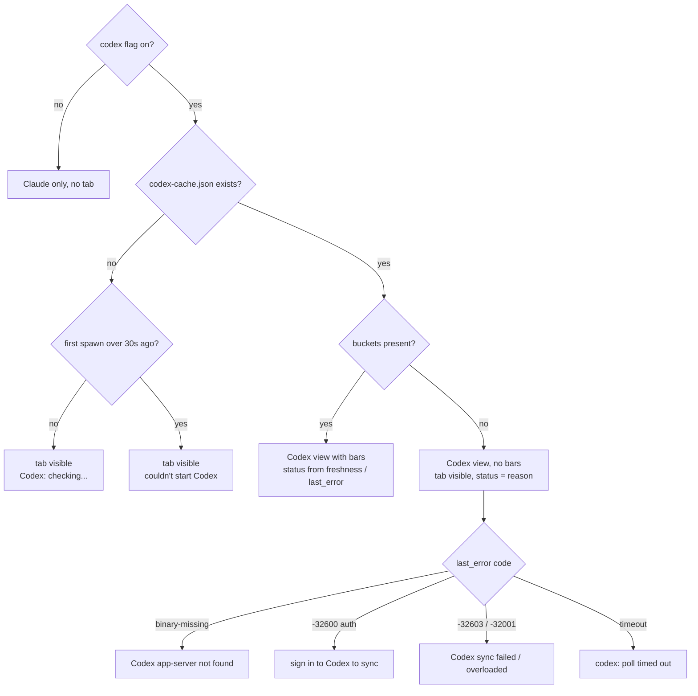
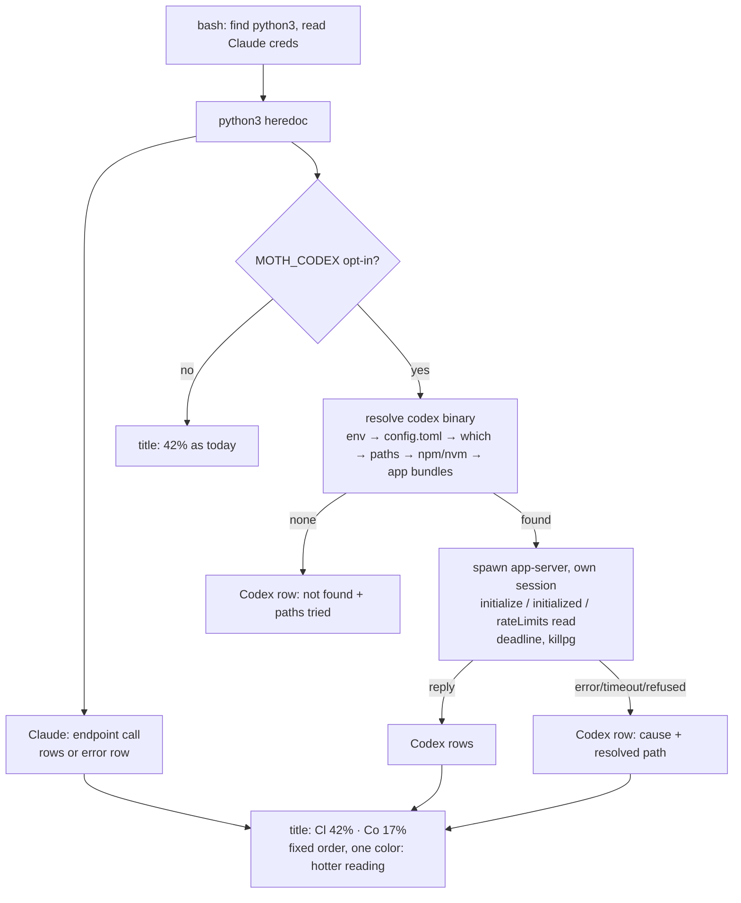

# feat: Codex provider for anyone, on Windows and Mac

## Summary

Take the Codex provider from one machine to the public repo. On Windows: fix the eight defects a public user would hit that the author's machine never did (silent failure when enabled, a tab trap, an uninstaller that rewrites everyone's settings, a 15-second poll during active Codex use, undiscoverable npm installs), ship the opt-in default, and document it with the same honesty the live-sync section has. On Mac: teach the SwiftBar plugin to read Codex through the app-server the same way, opt-in, both providers side by side, verified through a fixture harness because the author has no Mac. End at a commit-ready branch with a regenerated docs commit; the push is the author's call.

---

## Problem Frame

The Codex provider works on the author's machine (`docs/plans/2026-09-03-001-feat-codex-usage-provider-plan.md`). That plan deliberately scoped out public release, and the flow analysis for this one found why that mattered: every failure class on a fresh install is invisible (the flag appears to do nothing), the uninstaller now touches every user's `settings.json`, and the Mac cousin has no Codex path at all. The README also already under-reports what install does (the SessionStart hook is undisclosed), and the repo's honesty posture is its main asset. Publishing means closing those gaps, not just flipping a default.

---

## Requirements

Requirements from the prior plan (R1–R17 there) still hold; the ones below are what public release adds.

**Windows — visible and honest for a stranger**

- R1. With `codex: true` and no successful snapshot yet, the card shows the provider tab and the Codex-side reason (checking, not installed, sign in, timed out) instead of nothing — including before the first poll writes anything, and including when the helper never writes at all.
- R2. Codex status text distinguishes sign-in failures from backend or overload failures; a backend error never says "sign in".
- R3. The provider tab stays visible in the "waiting for Claude usage data" state, so a Codex-only user can switch back.
- R4. A `window-state.json` that fails to parse is logged once, naming the file, instead of silently reverting every setting.
- R5. Binary discovery finds a Codex CLI installed by npm or on PATH, not only the desktop app.
- R6. Helper spawns are spaced at least 60 seconds apart regardless of Codex activity; the first poll happens shortly after first paint, not three minutes later.
- R7. Tracked `config.json` ships `"codex": false` so the option is discoverable, and the flag default is unchanged for existing users.

**Windows — installer safety**

- R8. `uninstall.ps1` writes `settings.json` only when it removed something, and creates no backup when there is nothing to remove.
- R9. A malformed or empty `settings.json` is left byte-identical by install and uninstall, with a message naming the file.
- R10. A non-array hook event already in the file is refused before any write, never rewritten and then reported.
- R11. Event arrays the installer empties are collapsed, matching `uninstall.ps1`'s own convention.

**Mac**

- R12. The Mac plugin reads Codex through `codex app-server` only when the user opts in; with Codex absent or not opted in, its output is byte-identical to today.
- R13. Codex is discovered without relying on the login-shell PATH: environment override, Codex's own config record, `which`, the Homebrew/npm/standalone paths, and the desktop-app bundles.
- R14. The menu-bar title shows both providers in a fixed order, Claude first, the whole line colored by the hotter of the two known readings (per-number color lives only in the dropdown rows); a bare percentage when Codex is not configured.
- R15. Every Codex failure renders as a row in the dropdown naming the resolved path and the cause; a Claude failure becomes a row too, never an early exit that hides Codex.
- R16. A hung app-server is killed as a process group within the deadline; the plugin always exits 0.
- R23. No externally-sourced text (stderr, RPC error messages, discovered paths) can introduce a row parameter or an extra row; `|` and newlines are neutralized before any value reaches a menu line.
- R17. The Mac Codex path is verified by a fixture harness runnable on Windows, and the "community-tested" caveat is extended to cover it.

**Docs and release**

- R18. The README states every change install makes (three today), what the Codex opt-in changes (nothing at install time), and what the hook installer changes; the Files table and Privacy and Requirements sections are true after release.
- R19. A "Codex — the honest details" section discloses the experimental protocol, the spawned process and its login refresh, the config it loads, the activity signal, the cache contents, and that no Codex hooks are installed.
- R20. The hero GIF is unchanged; a second GIF in the Codex section shows the tab, a switch, and the hidden-provider halo, rendered from the real widget.
- R21. Rendering demos never reads or writes the author's `window-state.json` or live Codex cache.
- R22. The Mac plugin stays LF with the exec bit at the docs commit, and the branch ends commit-ready with the full suite green.

---

## Key Technical Decisions

- **Enabled-but-failing is a visible state, not a silent one.** Today every helper failure writes a cache without buckets, the reader returns null, and the card shows a Claude-only view with no tab — a public user reads that as "the flag does nothing". The cache reader now yields a Codex view whenever the flag is on and the cache exists, carrying `last_error` with no bars, so the tab appears and the Codex side says why. The flag-off case is untouched (prior R5 still holds).

- **Status text keys on the JSON-RPC error code, not the class — and both platforms use one string table.** `-32600` is JSON-RPC's generic "invalid request" (the same code the server returns for rejected params), so "sign in" requires `-32600` *and* an authentication mention in the message; `-32603` is backend failure, `-32001` overload, and `-32601` (method not found) is what an outdated binary produces and deserves its own actionable row. Telling a user to sign in when OpenAI's backend is down is the kind of wrong hint the live-sync section was rewritten to avoid. The table below is the single source; U1, U6, and U7 cite it rather than quoting variants, and a shared fixture file lets both test suites assert the identical strings.

  | key | trigger | text (identical on both platforms) | Mac row adds |
  |---|---|---|---|
  | binary-missing | discovery found nothing | `Codex app-server not found` | paths tried |
  | auth | `-32600` and message mentions auth | `sign in to Codex to sync` | resolved path |
  | backend | `-32603` | `Codex sync failed` | path, message excerpt |
  | overloaded | `-32001` | `Codex overloaded, retrying` | path |
  | too-old | `-32601` | `Codex too old for rateLimits/read` | path, override hint |
  | other-rpc | any other code | `Codex error <code>` | message excerpt |
  | timeout | deadline elapsed | `codex: poll timed out` | deadline, path |
  | exited | stdout closed or non-zero exit before reply | `Codex exited before answering (status N)` | first stderr line; quarantine hint when N is a signal |
  | parse-fail | reply parsed but carried no usable primary window | `Codex reply had no usable limits` | path |
  | spawn-failed | launch raised, or no cache written within 30 s of the first spawn | `couldn't start Codex` | reason, path |

  Every string in this table is a literal in both `widget.ps1` and `mac/moth.5m.sh` — the Mac plugin is a single file copied out of the repo and cannot read a fixture at runtime, and making a test asset load-bearing in production would be worse. `tools/fixtures/codex-status-strings.json` is the shared oracle both suites assert against, which is what catches drift between the two copies.

- **Discovery adds `Get-Command codex -CommandType Application` between the config record and the folder glob, and never returns a `.ps1`.** npm-installed Codex on Windows has no desktop hash folder and no `CODEX_CLI_PATH`. npm writes `codex`, `codex.cmd`, and `codex.ps1` side by side, PowerShell resolves the `.ps1` first, and `Process.Start` with `UseShellExecute=$false` rejects a `.ps1` outright ("not a valid application for this OS platform") — verified on this machine. So: take the first `.exe`, else the first `.cmd`. A `.cmd` runs `cmd.exe` → `node` → the native binary, and `Kill()` reaches only the top process, so the helper's timeout path terminates the tree with `taskkill /PID <id> /T /F` (the widget's own idiom) rather than orphaning a wedged app-server. The shim needs `node` on PATH; the helper inherits the widget's environment, which holds when the user can run `codex` from a shell — a version manager that sets PATH per session is the exception, and it surfaces as the binary-missing row plus the `codex_exe` override.

- **Spawn spacing is 60 seconds, with a first poll after first paint.** The rollout file advances on every streamed Codex turn and the poll tick fires an immediate helper on each advance, so an agentic run polls every 15 seconds — a spawn plus a backend call plus a possible `auth.json` rewrite. 60 seconds keeps the "refresh soon after a turn" promise without hammering the backend; the first-paint poll fixes a promise the prior plan made and never implemented.

- **Uninstall is write-on-change and backup-on-install only.** The hook uninstaller currently rewrites `settings.json` and creates a backup even when it removed nothing, and `uninstall.ps1` now calls it for everyone. That contradicts "everything else is left untouched" and is the exact shape of Cricket's data-loss bug from yesterday. Shape validation moves before the write.

- **Mac is opt-in, like Windows, through the plugin-variable mechanism both menu-bar hosts support.** Spawning a process that loads the user's MCP config and may refresh their Codex login is what the Windows honesty section warns about; doing it on sight because a binary exists would be worse on the platform the author cannot test. The opt-in is the `MOTH_CODEX` environment variable, declared in the plugin header as an `<xbar.var>boolean(MOTH_CODEX=false)` line: SwiftBar 2.1.0+ (August 2026) and xbar both parse the tag, show it in their plugin-settings pane, persist the value in a sidecar file they own, and inject it into the plugin's environment — the plugin never reads a file for opt-in. SwiftBar 2.0.1 ignores the tag, so the variable is absent and the plugin is opted out; those users can export it from `~/.bash_profile`, which SwiftBar's `bash -l` wrapper sources. Truthy values are `1`, `true`, `yes`, case-insensitive, because the two hosts serialize booleans differently. `<swiftbar.environment>` is rejected: it sets a default only and has no editor in any release. No marker file.

- **Mac spawns a fresh app-server per refresh; the daemon is rejected.** The daemon does run on macOS now, but it speaks websocket over a Unix socket (no stdlib client), only launches the standalone managed install, and starts an hourly self-updater. CodexBar and YASB both spawn per call. A 5-minute plugin has no reason to be the first daemon client.

- **Mac discovery runs in Python, not the shell, as a pure function.** SwiftBar runs plugins under `bash -l` with its own `bash` preference, so neither `.zshrc` nor `.zprofile` is sourced — Homebrew's PATH line is absent, which makes `/opt/homebrew/bin` in the list load-bearing rather than defensive. Order: `CODEX_CLI_PATH` env → best-effort `CODEX_CLI_PATH` line in `~/.codex/config.toml` → `which` → `/opt/homebrew/bin`, `/usr/local/bin`, `~/.local/bin`, `~/.codex/packages/standalone/current/bin`, `~/.npm-global/bin`, `$NPM_CONFIG_PREFIX/bin` → newest-by-mtime among `~/.nvm/versions/node/*/bin` and `~/.volta/bin` → `ChatGPT.app` and `Codex.app` `Contents/Resources/codex` under `/Applications` and `~/Applications`. No foreign process runs during discovery (`npm prefix -g` is dropped: it has no deadline and `npm` is usually unfindable for the same PATH reason). First found wins; an outdated binary is reported by the `-32601` row with an override hint, never probed around — each extra probe repeats the side effect the README discloses. The function takes `env`, `home`, and `which` as parameters so the harness can neutralize a real install on the test machine. The resolved directory is prepended to the child's PATH so an npm shim finds its `node`.

- **Mac title is fixed-order, Claude first, one color for the whole line.** A hotter-first order makes position meaningless, so identity is carried by order. A menu-bar line takes a single `color=`, so per-number color is not expressible; the title takes the color of the hotter known reading, and per-number colors live in the dropdown rows. States: Codex not configured → `42%` or muted `Moth`, unchanged from today; configured, both known → `Cl 42% · Co 100%` in the hotter color; one unknown → `Cl 42% · Co --%` in the known reading's color; both unknown → muted. Menu-bar overflow behavior is an author observation, not a cited fact.

- **Mac renders build-then-print; `bail()` is removed; each section catches its own failures.** Today the plugin prints as it computes and `bail()` exits mid-render, which with two providers means a Claude login problem hides a working Codex reading and a late exception yields a partial menu. Each provider becomes a function returning a title fragment and rows (a shared error-row shape), a composer joins them, and `main()` prints once. Each section carries its own `except Exception` returning the error-row shape, so a shape surprise inside the Codex path (a null `rateLimitsByLimitId.codex`, say) cannot drop the working Claude reading into the fallback — the exact failure build-then-print was adopted to prevent. `main()`'s last-resort `except` is reserved for composer bugs and still emits today's three-line fallback. Python-missing stays in bash, unchanged. This is also what makes the harness possible: it captures the composed list in-process instead of scraping a console.

- **Every externally-sourced string is sanitized before it reaches a row.** A SwiftBar row is `text | param=value`, and a row can carry a `bash=` parameter that runs a command when clicked. The plugin's `line()` helper joins on `|` with no escaping, and this plan newly routes raw Codex stderr, JSON-RPC error messages, and a path read from the user's `config.toml` into rows — so a crafted `| bash=…` in an error message would render as a clickable command in the menu. `line()` strips or escapes `|` and newlines in every text and attribute value, which also protects the existing Claude rows.

- **No Mac cache in v1.** A last-good cache would need a stale-as-fresh rule the author cannot observe, xbar does not set the data-path variable, and the plugin is stateless today. Errors render as errors.

- **Dev renders take a state file path.** `make-demo-gif.ps1` strips size keys from the author's live `window-state.json` with no try/finally, and a dev render with no Codex fixture falls through to the author's live Codex cache — so the "Claude" frames would show the author's real Codex numbers. A `-StatePath` dev parameter renders from a temp state and never touches the real one; `-CodexFixture empty` means no Codex view.

- **Hero GIF unchanged; Codex gets its own GIF.** Most visitors are Claude-only. The Codex section carries a second, smaller GIF from the same real-widget pipeline: tab visible, a switch, the halo warning from the hidden provider.

- **Codex hooks stay uninstalled and undocumented beyond that fact.** Whether the desktop app fires them is unconfirmed, they need in-app `/hooks` trust before a new hook runs, and there are open regressions upstream. The rollout-file signal is the documented behavior, not a fallback.

- **Mac verification is a fixture harness with four injection seams.** The Python heredoc is extracted by its `<<'PYEOF'`/`PYEOF` pair (which doubles as the LF and shebang check) and executed as a module. Four seams make it testable without test-only code in production: a command builder (`codex_command(path)`, which the harness replaces with `[python, fake_codex.py, "app-server"]` so the kill hits the right process on both platforms — no `.cmd` wrapper, which would orphan the child), `find_codex(env, home, which)`, `fetch_claude(token)`, and `main(env, home)`; the clock is pinned by replacing `time.time` on the module. A recorder around `Popen` turns spawn arguments into assertions. A golden file, captured from the pre-change heredoc with the same seams, proves Codex-absent and opted-out output is byte-identical; its fixture puts every `resets_at` in the past so countdown rows render the timezone-independent `resetting…`. This is the first committed Mac test; the earlier "5 cases pass" was never checked in.

---

## High-Level Technical Design

Windows failure-state rendering, replacing today's "no buckets → no view":



Mac plugin after the change — each provider renders independently:



Directional sketch of the Mac title rule:

```text
title(claude_pct, codex_state):
  if codex not configured:  return line(f"{claude_pct}%", color=color_for(claude_pct))   # unchanged
  cl = "Cl --%" if claude_pct is None else f"Cl {claude_pct}%"
  co = "Co --%" if codex has no reading else f"Co {codex_pct}%"
  hot = max of the known readings (None if neither)
  return line(f"{cl} · {co}", color=color_for(hot))        # one colour per line; never reordered

render(claude: Section, codex: Section | None) -> list[str]:
  [title, '---', header, '---', *claude.rows, ('---', *codex.rows if codex), '---', refresh]
main(env, home): print("\n".join(render(...)))            # one exit point; last-resort except -> fallback lines
```

Dev-render isolation for the GIF pipeline:

```text
make-demo-gif:
  state = temp file { "codex": true }           # author's window-state.json never opened
  for each frame: widget.ps1 -SelfTest <claude fixture> -CodexFixture <codex fixture | empty>
                             -Provider <claude|codex> -StatePath <state> -Screenshot <png>
  hero:  claude climb, codex fixture calm → tab visible but story unchanged? NO — hero uses -CodexFixture empty
  codex gif: claude 96% + codex calm (claude view) → switch → codex view, halo red from hidden claude → reset
```

---

## Implementation Units

Dependency order: U1, U2, U3, U4 are independent of each other (all Windows hardening); U5 depends on U1; U6 on nothing; U7 on U6; U8 on U1, U2, U4, U5, U6, U7; U9 last.

### U1. Visible failure states and status by error code

- **Goal:** An enabled-but-failing Codex is visible, correctly attributed, and never traps the user on a view with no data.
- **Requirements:** R1, R2, R3, R4, R7
- **Dependencies:** none
- **Files:**
  - `widget.ps1` (modify: `Read-CodexCache`, `ConvertTo-ProviderView`, `Update-Display` status block, the state-merge `catch`)
  - `capture-codex.ps1` (modify: `Set-LastError` records the JSON-RPC code; a `catch` around the launch records `spawn-failed`)
  - `config.json` (modify: add `"codex": false`)
  - `tools/fixtures/codex-cache.error-only.json`, `tools/fixtures/codex-cache.backend-error.json`, `tools/fixtures/codex-cache.parse-fail.json`, `tools/fixtures/codex-cache.spawn-failed.json` (new)
  - `tools/fixtures/codex-status-strings.json` (new; the shared string table both platforms' tests read)
  - `tools/test-resolve-provider.ps1` (modify) and the self-test acceptance runs
- **Approach:** `Read-CodexCache` returns a cache that has `last_error` even without buckets; `ConvertTo-ProviderView` yields a view with `p5 = $null` for that shape (and `capturedAt = $null` when the cache carries no `captured_at`, so an absent stamp never casts to 0 and renders "last synced 496000h ago"). The paint path renders `--%` bars with the tab visible, and any `last_error` class is handled before the stale branch. When the flag is on and no cache exists at all, the widget synthesizes an in-memory view: `Codex: checking…` until 30 seconds after the first spawn, then the `spawn-failed` text — so a helper that dies before writing (blocked execution policy, an uncreatable data dir, a failing launch) is visible rather than silent. The reducer's `codexPresent` becomes "a Codex view exists". Status text follows the shared string table in Key Technical Decisions, keyed on `last_error.code` when present: `-32600` maps to "sign in" only when the message mentions authentication; `-32601` gets the too-old row; `-32603` and `-32001` their own text; timeout and binary-missing unchanged. `capture-codex.ps1` records the code alongside the class. The strings live once in `tools/fixtures/codex-status-strings.json` so the Mac harness asserts the same text. When the selected view is absent but the tab is applicable, keep `TabGroup` visible and paint the waiting text. Log one line when `window-state.json` fails to parse. Add `"codex": false` to `config.json`; `$CODEX_ON` already treats absent and false alike.
- **Patterns to follow:** The existing `--%` handling for a missing weekly bucket; the live-sync status strings' "say what is actually happening" discipline; `Write-ErrorLog` once-per-state-change idiom.
- **Test scenarios:**
  - Flag on, cache with `last_error` binary-missing and no buckets → `Provider=codex`, `Tab=visible`, status "Codex app-server not found", bars `--%`. *(Covers R1.)*
  - Same with `-32600` and an auth message → "sign in to Codex to sync"; `-32600` without one → not "sign in"; `-32603` → "Codex sync failed"; `-32601` → the too-old row. *(Covers R2.)*
  - `last_error` class `parse-fail` with no code → "Codex reply had no usable limits", never a stale-time string.
  - `last_error` class `spawn-failed` → "couldn't start Codex". *(Covers R1.)*
  - Cache with `last_error` and no `captured_at` → `capturedAt` is null and no "last synced" text renders.
  - Flag on, no cache file, first spawn 5 s ago → tab visible, "Codex: checking…"; the same 40 s later → tab visible, "couldn't start Codex". *(Covers R1.)*
  - Codex fixture present, `-SelfTest empty -Provider claude` → `Tab=visible`, "waiting for Claude usage data...". *(Covers R3.)*
  - Flag off with the same error-only cache → today's line exactly, `Tab=hidden`.
  - Reducer: `codexPresent` true with an error-only view; auto-follow and pick behave as before.
  - Malformed `window-state.json` → one log line naming the file; defaults applied.
  - `config.json` with `codex: false` → `$CODEX_ON` false; with the key absent → false.
- **Verification:** The four self-test lines above; the flag-off line unchanged from the release; full suite green.

### U2. Discovery for CLI installs

- **Goal:** Find a Codex installed by npm or otherwise on PATH, on Windows.
- **Requirements:** R5
- **Dependencies:** none
- **Files:**
  - `capture-codex.ps1` (modify: `Find-CodexExe`)
  - `tools/test-codex-parse.ps1` (modify)
- **Approach:** Insert a `Get-Command codex -CommandType Application -All` step after the config-record step and before the hash-folder glob; take the first `.exe`, else the first `.cmd`, never a `.ps1` (an ExternalScript that `Process.Start` cannot launch). When the resolved file is a `.cmd`, or whenever the exchange times out, the helper's teardown terminates the tree with `taskkill /PID <id> /T /F` instead of `Kill()`, which reaches only `cmd.exe` and would leave `node` and the app-server running. Also test here, on Windows, whether `-s read-only -a never` are accepted before `app-server` and whether `--stdio` is accepted; record the result in the unit's commit message, since U6 adopts the flags only if they pass (the plan body is not edited during execution).
- **Patterns to follow:** Existing `Find-CodexExe` resolution order and its test's temp-folder scaffolding; `Get-Command claude` in `Invoke-TokenNudge`.
- **Test scenarios:**
  - No override, no config record, `codex` shim on a temp PATH, no hash folder → the shim is returned.
  - `codex.ps1` and `codex.cmd` side by side on the temp PATH → the `.cmd` is returned, never the `.ps1`. *(Covers R5.)*
  - Config record present and valid → still wins over PATH.
  - Both absent, hash folder present → glob still works.
  - Manual: a hanging `.cmd` shim → after the deadline no `node` or child process survives.
  - Launch throws (path resolves to an unlaunchable file) → `last_error` records `spawn-failed`, non-zero exit, no silent success.
  - Manual: `codex.exe -s read-only -a never app-server` answers `initialize` (or record that it does not).
- **Verification:** Discovery tests pass with the new case; the manual flag check is recorded in Open Questions.

### U3. Spawn spacing and first-paint poll

- **Goal:** Never spawn the helper more than once a minute; poll once soon after the card first paints.
- **Requirements:** R6
- **Dependencies:** none
- **Files:**
  - `widget.ps1` (modify: `Invoke-CodexPoll`, the `$poll` tick, `SourceInitialized`)
- **Approach:** `Invoke-CodexPoll` refuses to spawn within 60 seconds of the last spawn and remembers that a poll was wanted, so the next timer tick honors it. `SourceInitialized` schedules a one-shot first poll a few seconds after the timers start (a short `DispatcherTimer` that stops itself) rather than waiting the full interval.
- **Patterns to follow:** `$ep` backoff discipline; the "never block first paint" comment already in `SourceInitialized`.
- **Test scenarios:**
  - Manual: streaming Codex turn for three minutes → at most four helper spawns (log the spawn count in the self-test dump or a debug line).
  - Manual: fresh launch with the flag on → a snapshot within 10 seconds, not 180.
  - Backoff still capped below `stale_minutes`.
- **Verification:** Spawn count and first-snapshot timing observed live; suite green.

### U4. Installer safety for strangers

- **Goal:** The hook installer and `uninstall.ps1` never rewrite a file they did not change and never replace a file they cannot parse.
- **Requirements:** R8, R9, R10, R11
- **Dependencies:** none
- **Files:**
  - `tools/install-activity-hooks.ps1` (modify)
  - `tools/test-activity-hooks.ps1` (modify)
  - `uninstall.ps1` (modify: quiet the child's failure output)
- **Approach:** Move the parse and `Test-HooksShape` gate ahead of the execution-copy step, so a refusal touches neither file — today the copy is deleted in step 1 and the file is only read in step 2, which on a malformed file would leave the hooks pointing at a script that no longer exists and run a missing command on every prompt. Write only when `$added -or $removed`; take the backup only on install; refuse on a non-array event; collapse event arrays the uninstall emptied; treat an empty file like `install.ps1` does (fresh) and a malformed one as fatal-before-write; mirror `install.ps1`'s path refusal on `$TargetDir`; warn (do not block) if a `claude` process is running. `uninstall.ps1` passes `-Quiet` and prints one line on failure instead of a stack trace.
- **Patterns to follow:** `install.ps1` path refusal and backup-once; `uninstall.ps1` step 3b's collapse-empty-containers; Cricket's byte-for-byte regression test for a broken config.
- **Test scenarios:**
  - `-Uninstall` on a file with no Moth hooks → byte-identical, no `.moth-activity.bak`. *(Covers R8.)*
  - Install and `-Uninstall` on a file with a trailing comma → non-zero exit, byte-identical, message names the file. *(Covers R9.)*
  - Empty file on install → treated as fresh; on uninstall → byte-identical.
  - `"Stop": { ... }` object on install → refused before any write, file byte-identical, and no execution copy created. *(Covers R10.)*
  - `-Uninstall` against a trailing-comma file → refused, and `%LOCALAPPDATA%\Moth\touch-activity.ps1` still present, so the installed hooks keep working. *(Covers R9.)*
  - Install then `-Uninstall` where ours was the only `UserPromptSubmit` group → the event key is removed, not left as `[]`. *(Covers R11.)*
  - `$TargetDir` containing `%` → refused with the same message as `install.ps1`.
  - Existing idempotency, foreign-entry, and toucher-contract cases still pass.
- **Verification:** All new assertions pass; the live `settings.json` is never touched by the test run.

### U5. `-StatePath` dev render and the GIF pipeline

- **Goal:** Demo renders never read or write the author's state or live Codex cache, and the tool can render both providers.
- **Requirements:** R20, R21
- **Dependencies:** U1
- **Files:**
  - `widget.ps1` (modify: dev-mode `-StatePath`; `-CodexFixture empty` semantics)
  - `tools/make-demo-gif.ps1` (modify: temp state, per-frame provider and fixture, try/finally, second output)
  - `assets/moth-codex-demo.gif` (new); `assets/moth-demo.gif` regenerated only to prove it is unchanged
- **Approach:** `-StatePath` replaces `$stateFile` for the run; the GIF tool writes `{ "codex": true }` to a temp file for Codex frames and `{}` for hero frames, never opening the real one. `-CodexFixture empty` skips the live-cache fallback. Hero: existing 26-frame sequence with `-CodexFixture empty -Provider claude`, expected byte-identical frames. Codex GIF: Claude climbing to 96% on the Claude view with a calm Codex fixture (tab visible), two switch frames on the Codex view with the halo red from the hidden Claude, two reset frames. Wrap the frame loop in try/finally so a failed frame cannot leave temp state behind.
- **Patterns to follow:** Existing frame loop and `GifAnim.Patch`; the `-SelfTest` fixture loading; the repo rule that the GIF renders the real widget.
- **Test scenarios:**
  - Run with the author's real `window-state.json` and live Codex cache present → `window-state.json` byte-identical before and after, including after a forced frame failure; no frame contains the live Codex percentages. *(Covers R21.)*
  - `-CodexFixture empty` with a live Codex cache on disk → `Provider=claude Tab=hidden`.
  - Hero frames diff clean against the release GIF's frames (or the GIF is not re-committed).
  - Codex GIF: first frame shows the tab; switch frame shows `Provider=codex` with red halo; reset frame amber.
- **Verification:** Both GIFs render from the real widget; the state-file byte check passes.

### U6. Mac plugin: Codex section

- **Goal:** The SwiftBar plugin shows Codex usage beside Claude when opted in, degrades to rows on every failure, and is byte-identical to today otherwise.
- **Requirements:** R12, R13, R14, R15, R16
- **Dependencies:** none
- **Files:**
  - `mac/moth.5m.sh` (modify; header gains one `<xbar.var>` comment line)
- **Approach:** Keep the bash wrapper and the single heredoc. Inside it, restructure to build-then-print per the KTD: `claude_section` and `codex_section` each return a title fragment and rows, a composer joins them, `main(env, home)` prints once, `bail()` is deleted. Opt-in is `MOTH_CODEX` from the environment only (declared via the header tag); no file is read for it. Discovery per the KTD as `find_codex(env, home, which)` returning the path and the paths tried. Spawn exactly `[codex, "app-server"]` as Windows does — no `--stdio`, and the `-s read-only -a never` flags only if U2 verifies them on this build — through a `codex_command(path)` seam, with `start_new_session=True`, `cwd=home`, `encoding="utf-8", errors="replace"`, and a child PATH of the resolved directory plus `/opt/homebrew/bin:/usr/local/bin`. Reader and stderr threads are daemon threads (a blocked non-daemon read outlives every deadline); stderr keeps its first 2 KB for the error row instead of being discarded, since the Mac has no log. Reads are id-matched on a monotonic 12-second deadline with the same 200-line / 1 MiB cap as Windows; the protocol write catches `OSError` (a dead child raises `BrokenPipeError` on macOS but `EINVAL` on Windows). A kill helper has a POSIX branch (`os.killpg(proc.pid)`, then `wait(timeout=2)`) and a fallback `proc.kill()` branch. Parse `rateLimitsByLimitId.codex` then `rateLimits`; primary required; missing secondary renders `Weekly   --%` muted (the same string the Windows bar shows); apply the ms normalization and the reset-bounding window to Codex stamps as Windows does. Rows follow the shared string table; `FileNotFoundError` on a path that exists means a missing interpreter (npm shim without `node`) and says so; the quarantine hint attaches to both `PermissionError` and a signal exit. Every error group ends with a dim row naming the resolved path or the paths tried, and the issues link. Keep every existing Claude idiom (`or {}` null guard, no-redirect handler, required User-Agent); note that `round()` is half-even on both platforms so 42.5 renders 42 everywhere. Explicitly not ported: the reducer, tab, auto-follow and activity stamps, staleness, halo, hourglass, `plan_type`, the mutex, spawn spacing, and the state-file override.
- **Execution note:** Capture the golden file (U7) from the pre-change heredoc *before* touching the render tail, so byte-identity is enforced while restructuring.
- **Patterns to follow:** The existing `line()`/`color_for()` helpers and palette; the deterministic per-model tie-break comment (mirror it for the title rule); YASB's `codex_api.py` reader-thread pattern; CodexBar's resolution order; `capture-codex.ps1` for caps, bounding, and error-wins.
- **Test scenarios:** enumerated in U7. Code-read only: the `killpg` call on the POSIX branch and the quarantine hint copy.
- **Verification:** U7 harness green; `git ls-files --eol mac/moth.5m.sh` shows `i/lf w/lf` and mode `100755`.

### U7. Mac fixture harness with a fake `codex`

- **Goal:** Make "tested against fixtures" literally true and runnable on Windows.
- **Requirements:** R17
- **Dependencies:** U6
- **Files:**
  - `tools/test-mac-plugin.py` (new; driven by `python3`/`python` on either platform)
  - `tools/fixtures/fake-codex.py` (new: plays back a named canned reply, or hangs, or exits 1)
  - `tools/fixtures/mac-claude-usage.json`, `tools/fixtures/mac-golden-codex-absent.txt` (new)
  - reuse `tools/fixtures/codex-ratelimits-*.json`
- **Approach:** Capture the golden first, from the version at `HEAD` rather than the refactored file: extract the heredoc from `git show HEAD:mac/moth.5m.sh`, exec it with `urllib.request.build_opener` patched to return the canned Claude payload, `time.time` pinned, `CLAUDE_CRED` in the environment, and `SystemExit` caught (the committed heredoc has none of the seams — it reads the environment, opens urllib at module level, and exits through `bail()`), then commit the golden in its own commit before any edit to the plugin. A golden generated from the refactored code could never fail the test it exists to guard. Thereafter: read `mac/moth.5m.sh` as bytes; fail on any `\r` or a first line other than `#!/bin/bash`; locate the single `<<'PYEOF'` … `PYEOF` pair and execute the text between as a module with `__name__` not `"__main__"`. Inject the seams: `fetch_claude` returns the canned Claude payload; `codex_command` returns `[sys.executable, fake_codex.py, "app-server"]`; `find_codex` gets a temp `home` and a stub `which`; `time.time` is replaced on the module with a pinned `NOW`. Wrap `subprocess.Popen` with a recorder that captures kwargs. Call `main(env, home)` and capture stdout and stderr in-process; compare decoded UTF-8, never console bytes. `fake-codex.py` plays a named scenario from an argument or environment variable: full, calm (17%), no-weekly, `-32600` auth, `-32600` non-auth, `-32601`, `-32603`, out-of-order ids, notification-then-reply, garbage-then-reply, 300 notifications (over cap), hang, exit-1. The golden's Claude fixture has every `resets_at` in the past relative to `NOW`. Status strings are read from `tools/fixtures/codex-status-strings.json`.
- **Patterns to follow:** The repo's pass/fail/exit-1 test shape and pinned-clock discipline (`test-codex-parse.ps1`); Cricket's shim-on-PATH isolation.
- **Test scenarios:**
  - Codex absent, opt-in unset → stdout byte-identical to the golden; `Popen` never called. *(Covers R12.)*
  - Codex present via a working fake, opt-in unset, `MOTH_CODEX=false`, and `MOTH_CODEX=0` → golden, `Popen` never called. *(Covers R12.)*
  - Codex absent, opt-in set → not-found row listing the paths tried; Claude rows unchanged.
  - Discovery: stub at `CODEX_CLI_PATH` wins over a stub on `which`; a stub under a temp `~/.nvm/versions/node/v20/bin` is found and its directory leads the recorded child PATH. *(Covers R13.)*
  - Full reply → title text `Cl 42% · Co 100%` in that order with `color=` red; Codex group rows; `acct_FIXTURE` absent from output. *(Covers R14.)*
  - Calm reply → `Cl 42% · Co 17%` amber.
  - No weekly bucket → `Weekly   --%` muted, never `0%`.
  - `-32600` with an auth message → sign-in row; `-32600` without → generic error row, not sign-in; `-32601` → too-old row; `-32603` → sync-failed row; `error.data` text never in output. *(Covers R15.)*
  - Out-of-order ids, notification-then-reply, garbage-then-reply → correct reply picked; over-cap → exited row, no hang.
  - Well-formed result with `rateLimits: null` → the parse-fail row, Claude rows intact (proves the per-section except).
  - Fake stderr containing `| bash=rm -rf ~` → the text renders inert in the row, with no `bash=` parameter and no extra row. *(Covers the sanitizer.)*
  - Hang → timed-out row naming the path, runtime within deadline + 5 s, exit 0, empty stderr (proves the fallback kill branch on Windows). *(Covers R16.)*
  - Exit 1 immediately → exited row with status and the first stderr line; empty harness stderr.
  - Recorder: `start_new_session` true, `cwd` is the injected home, all three streams piped.
  - Claude creds absent, Codex fine → Claude not-logged-in row, Codex rows present, title `Cl --% · Co 17%`.
  - Every case: empty stderr and no exception escaped.
  - python3-missing path unchanged (bash-level; asserted by reading).
- **Verification:** Harness passes on Windows; the golden file and the status-strings fixture are committed.

### U8. README and Mac README

- **Goal:** Every promise in the docs is true after release, and the Codex opt-in is documented with the live-sync section's honesty.
- **Requirements:** R18, R19, R20 (image placement), R22 (Cricket sync check)
- **Dependencies:** U1, U2, U4, U5, U6, U7 (so the text matches what shipped)
- **Files:**
  - `README.md` (modify — on top of the Cricket sibling paragraph already committed in `9f69780`)
  - `mac/README.md` (modify)
- **Approach:** Rewrite "What install does" as three changes (statusLine, SessionStart hook, `/moth`) and state that the Codex opt-in makes none, and the hook installer makes its own (two hook events, one file under `%LOCALAPPDATA%\Moth`, its own backup, its own `-Uninstall`). Add the short opt-in block after live sync (`"codex": true`, `/moth`, "first numbers within seconds", the optional hook installer command, "auto-follow needs the hooks and terminal Claude Code; otherwise use the tab"). Add `## Codex — the honest details (\`codex\`)` with the nine disclosures: experimental app-server; a hidden `codex app-server` launched as you every ~3 minutes and after a Codex turn (60 s minimum); Moth never reads `~/.codex/auth.json` but the spawned process does and may refresh it; it loads your full Codex config including MCP servers, measured on 0.152.0 not to start them; activity is the write time of the newest sessions rollout, never read; no Codex hooks installed; what the cache holds (percentages, resets, window minutes, plan type, a truncated error message — no account id, credits, or token); the Claude hooks' contract and location; discovery order and the `codex_exe` override with a forward-slash example. Qualify "nothing is sent anywhere" and Privacy with "by default". Extend Requirements (tested with codex-cli 0.152.0 desktop build; ChatGPT sign-in, not API key; `codex_exe` for unusual installs; Codex-only users need `-AutoStart`). Update "What the bars mean" (tab, `--%`, hidden-provider halo, per-model is Claude-only) and "Turn it off" (flag, hook uninstall, leftovers under `%LOCALAPPDATA%\Moth`). Files table: new scripts, `tools/`, and a second table for `%LOCALAPPDATA%\Moth`; fix the `widget-error.log` row. Place the Codex GIF in the Codex section. Mac README: requirements; the opt-in as a plugin variable (SwiftBar 2.1.0 or newer shows it in the plugin's settings; on 2.0.1 export `MOTH_CODEX=1` from `~/.bash_profile`, which is also where `CODEX_CLI_PATH` goes — not `.zshrc`, which SwiftBar never sources); discovery order; the honest-details mirror; the Keychain note for `codex`; the refresh-by-name URL (`swiftbar://refreshplugin?name=moth`); the extended community-tested caveat; and what each error row means. Verify Cricket's README needs no change (its cross-link and Codex posture already exist).
- **Patterns to follow:** The live-sync short block and honest-details section, verbatim in structure; `mac/README.md`'s community-tested blockquote.
- **Test scenarios:** Test expectation: none — documentation. Acceptance is the checklist in Acceptance Examples (docs group).
- **Verification:** Every item in the docs acceptance list is present; no absolute paths; the Cricket paragraph survives.

### U9. Release checklist

- **Goal:** A commit-ready branch the author can push.
- **Requirements:** R22
- **Dependencies:** U8
- **Files:** none new
- **Approach:** Full suite green (all four PowerShell suites plus the Mac harness); the flag-off self-test line identical to the release; `git ls-files --eol mac/moth.5m.sh` LF and `100755`; `git status` clean; the docs commit last, containing README, Mac README, and both GIFs, in the repo's feat → docs sequence. No push.
- **Test scenarios:** Test expectation: none — process gate.
- **Verification:** The checklist passes and the author is handed the branch.

---

## Scope Boundaries

- Codex credits, plan type display, upsell; per-model Codex bars; cost or token tracking.
- Installing Codex hooks on either platform, or documenting a hand-add snippet.
- A Mac last-good cache, hook-triggered `swiftbar://` refresh, or streamable plugin mode.
- Folding the hook installer into `install.ps1`.
- Pushing, opening a PR, or editing Cricket.

### Deferred to Follow-Up Work

- Distinguish more JSON-RPC codes as they appear in the wild.
- A Mac cache with an honest stale rule, once someone with a Mac can observe it.
- `ce-compound` on the settings.json rule set and the live-found Codex bugs.
- Codex hook installation if the desktop app is confirmed to fire hooks.

---

## Open Questions

**Deferred to implementation**

- Whether `codex -s read-only -a never app-server` accepts the flags before the subcommand, and whether `--stdio` is accepted on this build (U2 tests both on Windows; U6 adopts nothing unverified — the bare `app-server` form is the one proven).
- Whether a quarantined binary launched from a background process fails with `PermissionError` or dies by signal (the hint attaches to both paths regardless).
- Whether SwiftBar's `ansi=true` renders in the title and on xbar (only matters if per-number title color is ever revisited).
- Whether the Mac desktop app records `CODEX_CLI_PATH` in `~/.codex/config.toml` (Windows does; treated as best-effort).
- Whether Claude Code applies externally edited hooks live or at next session start (docs say "takes effect in your next Claude session" either way).
- Behavior of `account/rateLimits/read` under an API-key-only login (documented as unsupported regardless).
- Whether a Codex Keychain credential store on macOS prompts on background spawn (mentioned in the Mac README next to the existing Keychain note).
- The exact ChatGPT.app / Codex.app bundle path for the bundled CLI (CodexBar's list is used verbatim; unverified on a real Mac).

---

## Risks & Dependencies

- **Nothing on Mac is observed.** Every Mac assertion is fixture- or code-read-based; the caveat stays and error rows carry the resolved path so a stranger's bug report is actionable.
- **Experimental protocol.** Same mitigation as before: nullable-tolerant parser, one log line, grey bars.
- **Editing strangers' `settings.json`.** U4's byte-identity tests are the gate; Cricket's data-loss bug is the precedent.
- **Gatekeeper.** A quarantined binary fails to spawn from a background process with no dialog; the row names the path and the `xattr` fix.
- **npm shim needs node.** On both platforms the shim is a script; the resolved directory (and Homebrew dirs on Mac) are on the child's PATH.
- **OneDrive and repo moves.** Hooks run from the out-of-repo copy; the README says to re-run the installers after a move.
- **`config.json` conflict on pull** for users who edited it; documented one-liner.

---

## Acceptance Examples

Windows (fixture-verifiable unless marked manual):

- AE1. **Covers R1.** Given `codex: true` and a cache with only `last_error` (binary-missing), when rendered, then the tab is visible, bars show `--%`, and the status reads "Codex app-server not found".
- AE2. **Covers R2.** Given `last_error` with code `-32603`, then the status is "Codex sync failed", not "sign in".
- AE3. **Covers R3.** Given a Codex view and no Claude cache, when the Claude tab is picked, then the tab stays visible with "waiting for Claude usage data...".
- AE4. **Covers R4.** Given an unparseable `window-state.json`, then one log line names it and defaults apply.
- AE5. **Covers R5.** Given no desktop install and `codex` on PATH, then discovery returns it.
- AE6. **Covers R6.** *(manual)* Given a three-minute streaming Codex turn, then at most four helper spawns.
- AE7. **Covers R6.** *(manual)* Given a fresh launch with the flag on, then a snapshot within 10 seconds.
- AE8. **Covers R7.** Given `config.json` with `codex: false` and no state key, then no tab and no spawn.
- AE9. **Covers R8.** Given no Moth hooks, when `-Uninstall` runs, then the file is byte-identical and no backup is created.
- AE10. **Covers R9.** Given a trailing comma, when install or uninstall runs, then non-zero exit, byte-identical file, message names it.
- AE11. **Covers R10.** Given `"Stop": {}` as an object, when install runs, then it refuses before writing.
- AE12. **Covers R11.** Given ours was the only group in an event, when `-Uninstall` runs, then the event key is gone, not `[]`.
- AE13. **Covers R21.** Given the author's live state and Codex cache, when the GIF tool runs and a frame is forced to fail, then `window-state.json` is byte-identical and no frame shows live numbers.
- AE14. **Covers R20.** Given the Codex GIF, then frame 1 shows the tab, the switch frame shows the Codex view with a red halo, the reset frame is amber.
- AE27. **Covers R1.** Given the flag on and no cache file, then within 30 s of the first spawn the tab is visible with "Codex: checking…", and after 30 s with no cache it reads "couldn't start Codex".
- AE28. **Covers R2.** Given a cache whose `last_error` has no code and class `parse-fail`, then the status reads "Codex reply had no usable limits" and no "last synced" text appears.
- AE29. **Covers R5.** Given `codex.ps1` and `codex.cmd` on PATH, then discovery returns the `.cmd`.
- AE30. **Covers R9.** Given a malformed `settings.json`, when `-Uninstall` runs, then it refuses and the installed `touch-activity.ps1` copy is still present.

Mac (harness unless marked code-read):

- AE15. **Covers R12.** Given opt-in unset, with or without a working Codex present, then stdout equals the golden file and no process is spawned.
- AE16. **Covers R13.** Given a stub at `CODEX_CLI_PATH` and another on `which`, then discovery returns the override and lists it; given the exchange with the fake, then the Codex rows name the resolved path.
- AE17. **Covers R14.** Given Claude 42% and Codex 100%, then the title text is `Cl 42% · Co 100%` in that order, colored red (the hotter reading).
- AE18. **Covers R15.** Given `-32600` with an auth message, then the sign-in row; given `-32600` without one, then not the sign-in row; given `-32601`, then the too-old row; given `-32603`, then the sync-failed row; and `error.data` text never appears.
- AE19. **Covers R15.** Given no Claude credentials and Codex healthy, then the Claude row says not logged in, the Codex rows render, and the title is `Cl --% · Co 17%`.
- AE20. **Covers R16.** Given a hanging fake `codex`, then the timed-out row names the path, the run finishes within deadline + 5 s, exit 0, empty stderr (the Windows kill branch; the POSIX branch is code-read).
- AE21. **Covers R16.** Given any spawn, then the recorder shows `start_new_session`, piped streams, and `cwd` equal to home; the `killpg` call itself is code-read.
- AE22. **Covers R13.** Given an nvm-resolved shim, then its directory leads the recorded child PATH.
- AE31. **Covers R23.** Given fake stderr containing `| bash=rm -rf ~`, then the row renders the text inert, carries no `bash=` parameter, and adds no extra row.
- AE32. **Covers R15.** Given a well-formed result whose `rateLimits` is null, then the Codex group shows the parse-fail row and the Claude rows are unaffected.

Docs:

- AE23. **Covers R18.** "What install does" lists three changes; the Codex opt-in is stated to change nothing at install; the hook installer's changes are listed; the Files table includes the `%LOCALAPPDATA%\Moth` rows; Privacy and "nothing is sent anywhere" say "by default"; Requirements name the tested Codex version and the sign-in constraint.
- AE24. **Covers R19.** The Codex honest-details section contains all nine disclosures.
- AE25. **Covers R17.** The Mac README's community-tested caveat names the Codex path and what was not verified.
- AE26. **Covers R22.** `mac/moth.5m.sh` is LF and `100755` at the docs commit; the full suite and the Mac harness pass.

---

## System-Wide Impact

- **Every user's `settings.json`** is touched by `uninstall.ps1` today; after U4 it is touched only when something is removed.
- **Public contract surfaces:** `config.json` gains a key; `widget.ps1` gains a dev parameter; the README's disclosure section changes meaning. Existing users see no behavior change with the flag absent.
- **Backend load:** a spawn plus one backend call at most once a minute per user with the flag on, and once per 5-minute refresh on Mac when opted in.
- **The Mac plugin's render tail is restructured**; the golden test is the guard that Claude-only output is unchanged.

---

## Sources & Research

- Prior plan and its live findings: `docs/plans/2026-09-03-001-feat-codex-usage-provider-plan.md` (path quoting, null-stamp pinning, WAL heartbeat, process supervision).
- Repo anchors: `install.ps1` (path refusal, backup-once, byte-level BOM check), `uninstall.ps1` (step 2d and 3b), `tools/install-activity-hooks.ps1`, `tools/make-demo-gif.ps1` (state stripping at the top of the frame loop, no try/finally), `mac/moth.5m.sh` (`line`, `bail`, `color_for`, the parity comment on the per-model pick), `.gitattributes` (`*.sh text eol=lf`).
- Cricket precedent: `claude-cricket/install.ps1` and `tools/test-hooks.ps1` (shim-on-PATH isolation; the 2026-09-03 data-loss fix that refuses to touch an unparseable config).
- Codex on macOS: npm platform package layout `@openai/codex-darwin-arm64/vendor/aarch64-apple-darwin/bin/codex`; Homebrew is a cask (`brew install --cask codex`) symlinking into the prefix bin; app bundles `ChatGPT.app`/`Codex.app` `Contents/Resources/codex` (CodexBar's `PathEnvironment.swift` and `codex-rs/cli/src/desktop_app/mac.rs`); daemon README and `daemon-lib.rs` (managed-install-only launch, websocket over `$CODEX_HOME/app-server-control/app-server-control.sock`); `RateLimitWindow.ts` and `GetAccountRateLimitsResponse.ts`; YASB `codex_api.py` (reader thread, queue, deadline, teardown); SwiftBar README (multiple header lines cycle, `dropdown=false`, `refresh=true`, one `color=` per line), `RunScript.swift` (`bash -l -c` wrapper under a `bash` preference regardless of the login shell), `PluginMetadata.swift` and the 2.1.0 release notes (`<xbar.var>` parsed since 2.1.0, values injected last so user settings win), `PluginDetailsView.swift` (the variables editor; no editor for `<swiftbar.environment>`), `PluginManger.swift` (refresh-by-name matching); xbar's `variables.go` and plugin guide (the same tag, sidecar `.vars.json`); Codex hooks docs and issues #21639, #37362, #33992 (desktop firing, `/hooks` trust, regressions); `rollout/src/recorder.rs` (sessions path).
- Flow analysis findings H1–H8 and decisions D1–D7, with the author's choices: hero unchanged plus a Codex GIF; Mac title fixed-order Claude-first.
